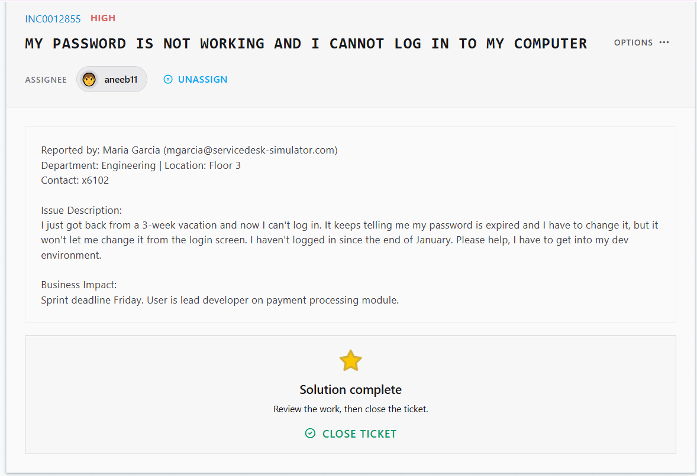
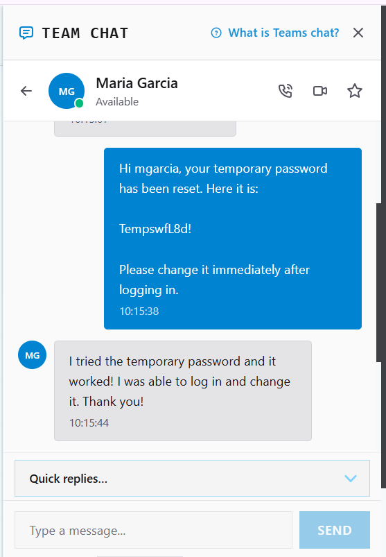

# Ticket Resolution: Expired Password — Login Failure

**Assignee:** aneeb11
**Reported by:** Maria Garcia (mgarcia@servicedesk-simulator.com)
**Department:** Engineering | Floor 3 | x6102
**Date Resolved:** 2026-08-04

---

## Issue Description

User returned from a 3-week vacation and was unable to log in to her computer. Login screen indicated the password had expired and required a change, but the self-service change flow at the login screen would not proceed. User's last login was end of January. User is lead developer on the payment processing module with a Friday sprint deadline, access to dev environment required.

## Business Impact

- Sprint deadline: Friday
- User role: Lead developer, payment processing module
- Priority: High (active deadline + inability to work)

## Root Cause

Password expired under domain password policy due to extended absence (no login since end of January), exceeding the standard password max-age. Self-service reset at the login screen failed to complete.

## Resolution Steps Taken

1. Opened **Tools > Active Directory Users and Computers** (directory search).
2. Searched and located user account: **Maria Garcia**.
3. **Verified identity** sent a verification code to the user and confirmed before taking action.
4. **Reset password** from AD directly (bypassing the client-side self-service flow).
5. Sent user a **temporary password** with instructions to log in and change it.
6. Confirmed user regained access.

## Outcome

✅ Resolved -> user successfully logged in with temp password.

## Screenshots

