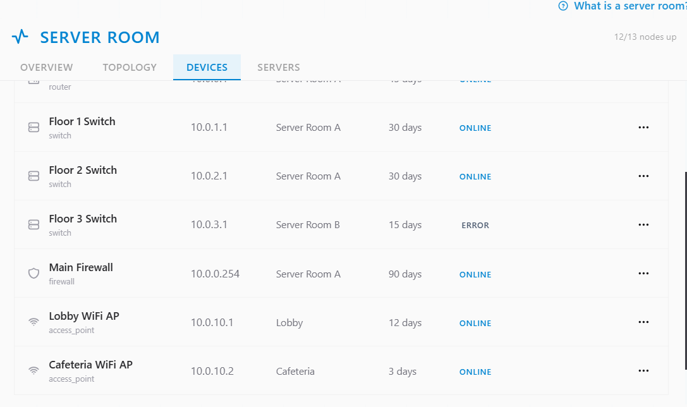
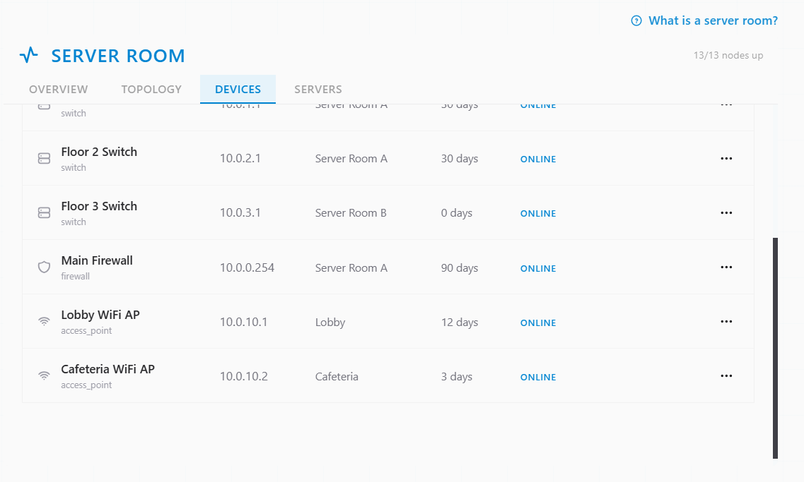
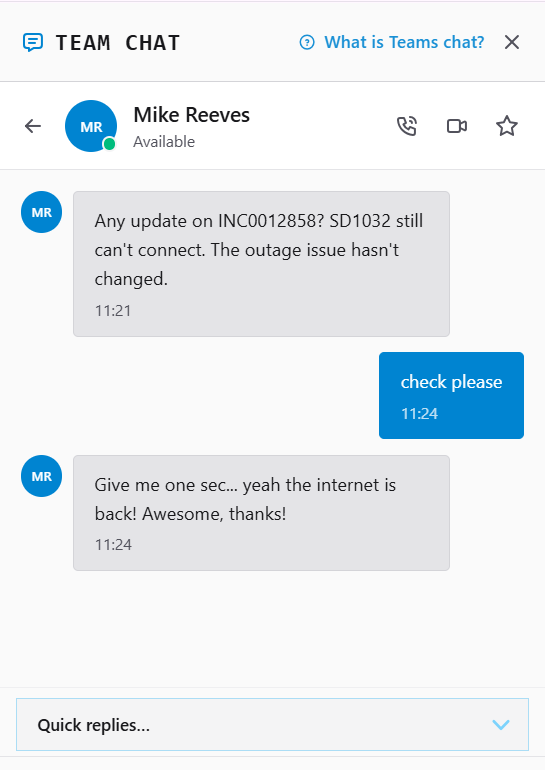

# Ticket Resolution: INC0012858 - Floor 3 Internet Outage

**Assignee:** aneeb11
**Reported by:** Mike Reeves (mreeves@servicedesk-simulator.com)
**Department:** Facilities | Location: Floor 3 | x1095
**Priority:** Critical
**Date Resolved:** 2026-08-04

## Issue Description

No internet access for any users on Floor 3, started roughly 30 minutes prior to the report. Affected websites, conference rooms, and CRM access for the customer service team. Floor 2 confirmed unaffected, isolating the issue to Floor 3.

## Business Impact

Multiple departments on Floor 3 unable to work. Customer service team unable to access CRM.

## Root Cause

Floor 3 network switch became unresponsive, cutting off internet access for all devices on that floor while other floors remained unaffected.

## Resolution Steps Taken

### 1. Located the affected device

Opened Tools → Server Room → Devices tab and found the Floor 3 Switch showing a faulted/offline state.

### 2. Rebooted the switch

Clicked the Power button on the Floor 3 Switch and waited 30–60 seconds for it to come back online.

### 3. Confirmed with user

Reached out to Mike over Team Chat, who confirmed internet access was restored on Floor 3.

## Outcome

Resolved -> Floor 3 switch rebooted, internet access restored and confirmed by user.

