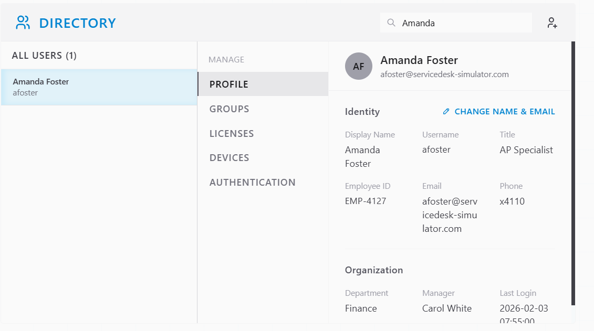
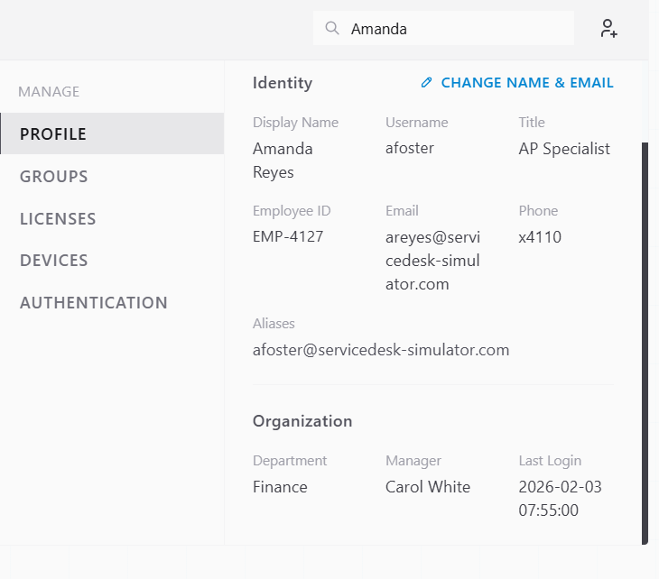
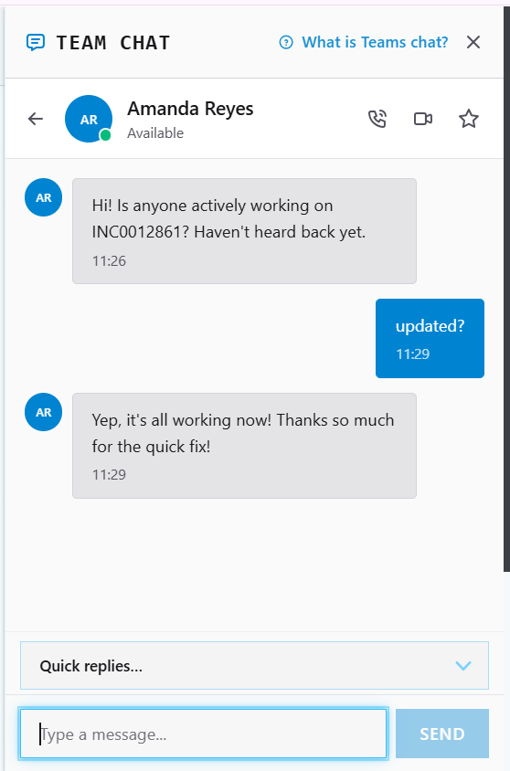
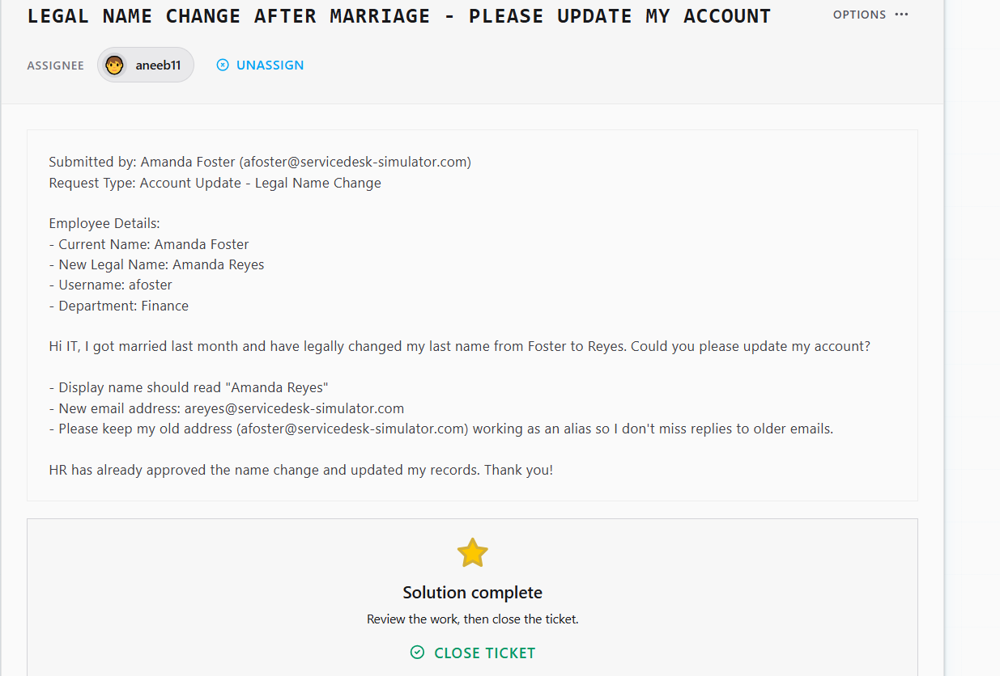

# Ticket Resolution: Legal Name Change - Amanda Foster to Amanda Reyes

**Assignee:** aneeb11
**Submitted by:** Amanda Foster (afoster@servicedesk-simulator.com)
**Department:** Finance
**Request Type:** Account Update - Legal Name Change
**Date Resolved:** 2026-08-04

## Request Description

User legally changed her last name from Foster to Reyes following marriage, with HR already having approved and updated records. Requested updates:

- Display name changed to "Amanda Reyes"
- New email address: areyes@servicedesk-simulator.com
- Old address (afoster@servicedesk-simulator.com) retained as a working alias so existing email threads aren't missed

## Resolution Steps Taken

### 1. Located the account

Opened Directory, searched and found the user's account under the old name.

### 2. Updated the account

Changed display name to Amanda Reyes and updated the primary email to areyes@servicedesk-simulator.com, keeping afoster@servicedesk-simulator.com active as an alias.

### 3. Confirmed with user

Notified Amanda over Team Chat that the update was complete and her old address would continue working as an alias.

## Outcome

Resolved -> display name and primary email updated, old address retained as alias.

