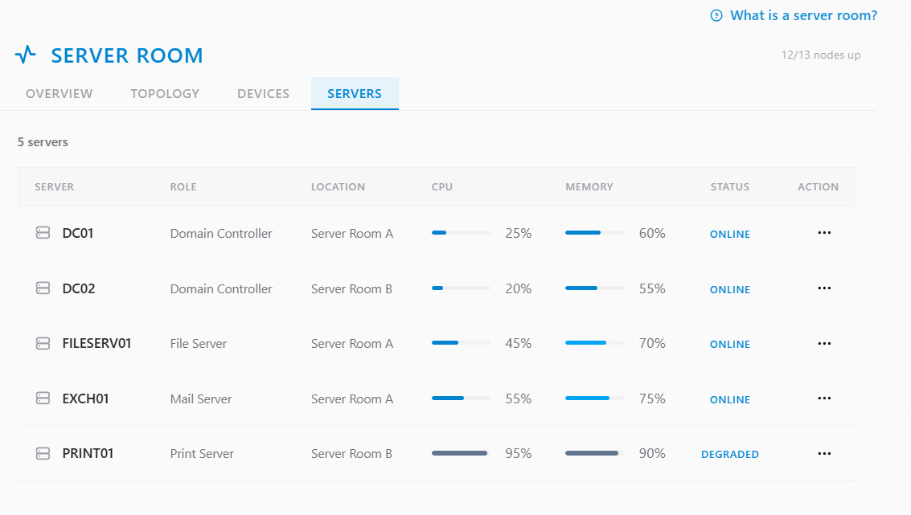
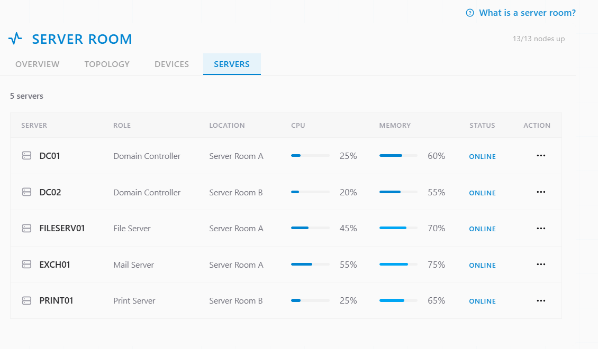
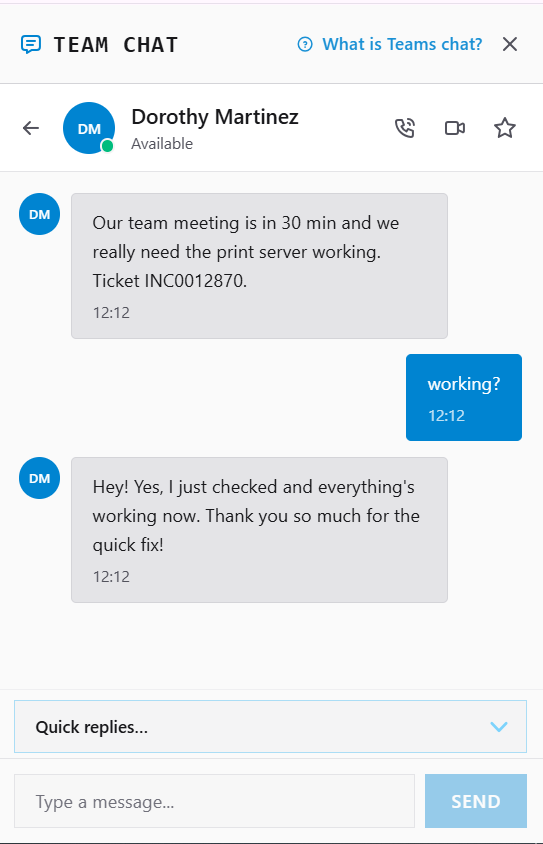
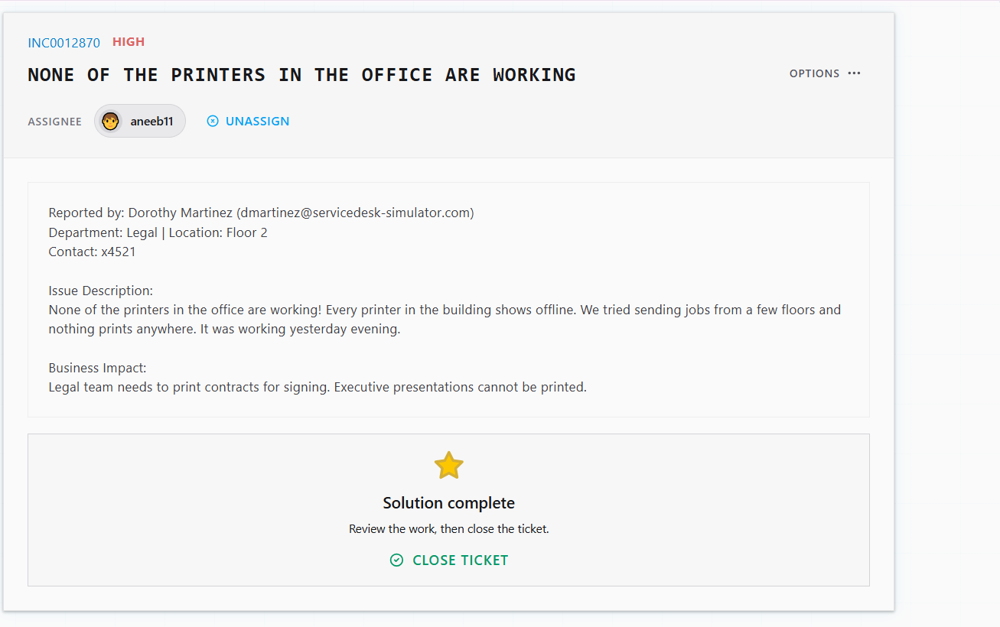

# Ticket Resolution: INC0012870 - All Printers Offline Building-Wide

**Assignee:** aneeb11
**Reported by:** Dorothy Martinez (dmartinez@servicedesk-simulator.com)
**Department:** Legal | Location: Floor 2 | x4521
**Priority:** High
**Date Resolved:** 2026-08-05

## Issue Description

Every printer in the building showing offline, with print jobs failing from multiple floors. Working normally as of the previous evening.

## Business Impact

Legal team unable to print contracts for signing. Executive presentations could not be printed.

## Root Cause

Print server was under heavy load, with CPU at 95% and memory at 90%. Resource exhaustion on the print server caused it to stop processing jobs, taking every connected printer offline building-wide.

## Resolution Steps Taken

### 1. Located the print server

Opened Tools → Server Room → Servers and identified the print server showing CPU at 95% and memory at 90%.

### 2. Rebooted the server

Rebooted the print server. After it came back online, CPU dropped to 25% and memory to 65%.

### 3. Confirmed with user

Confirmed over Team Chat with Dorothy that printers were back online and working.

## Outcome

Resolved —> print server rebooted, resource usage back to normal, printers confirmed working building-wide.

