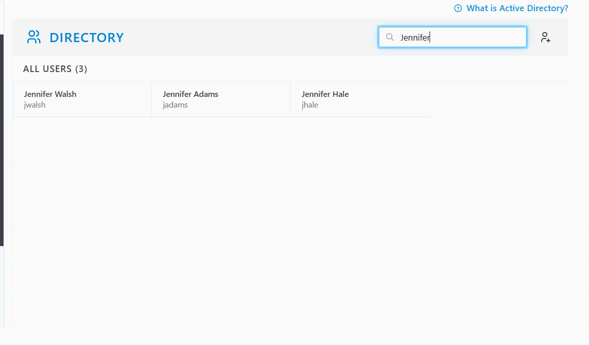
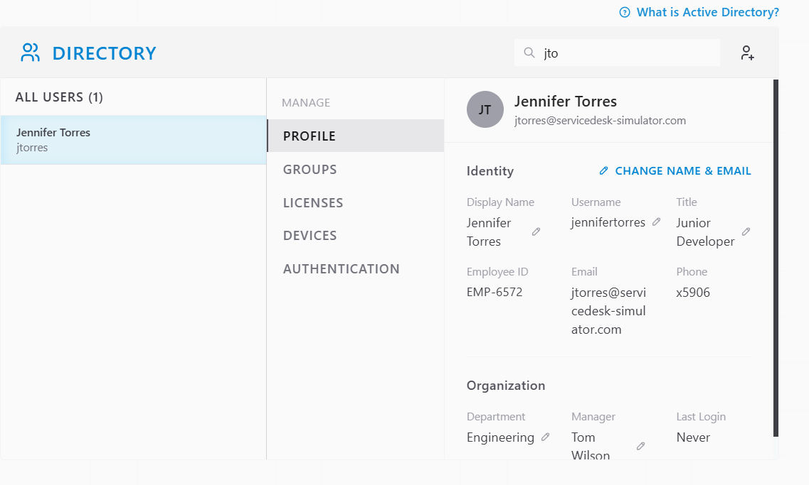
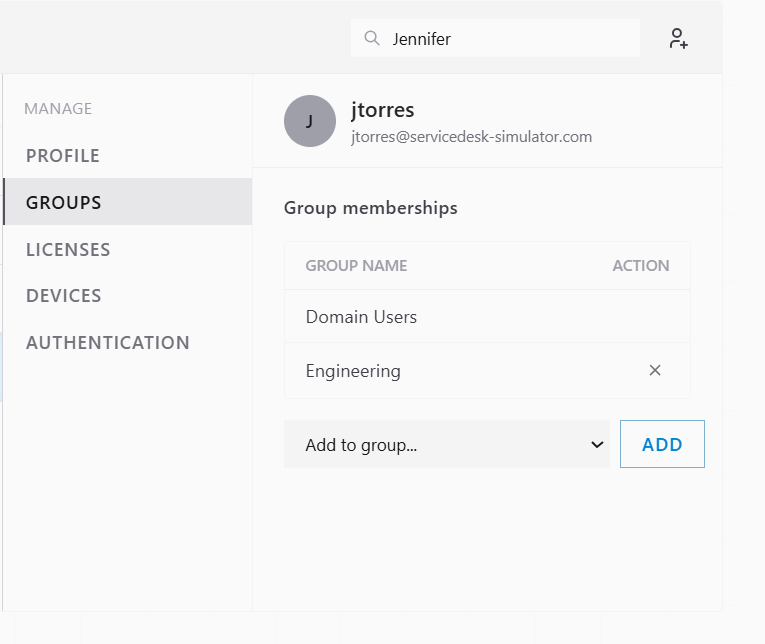
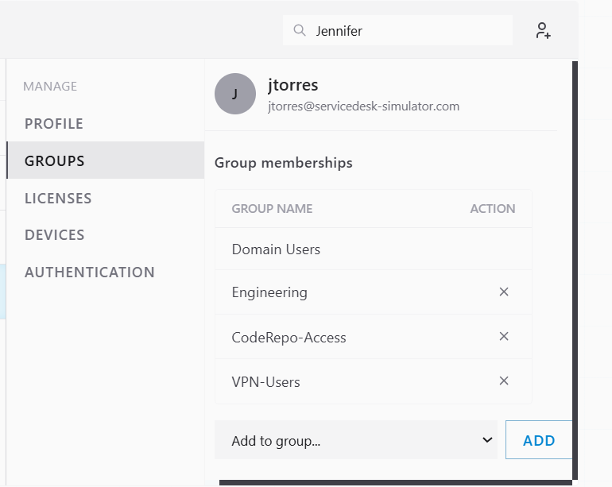
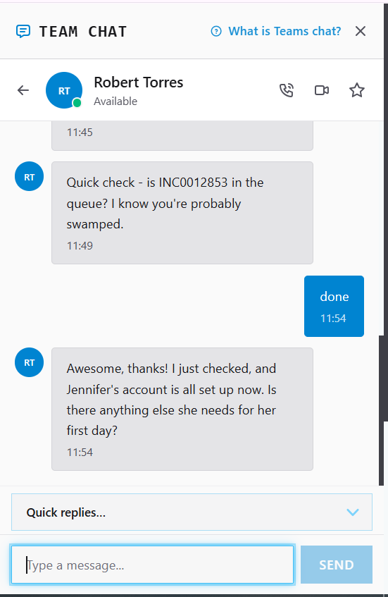
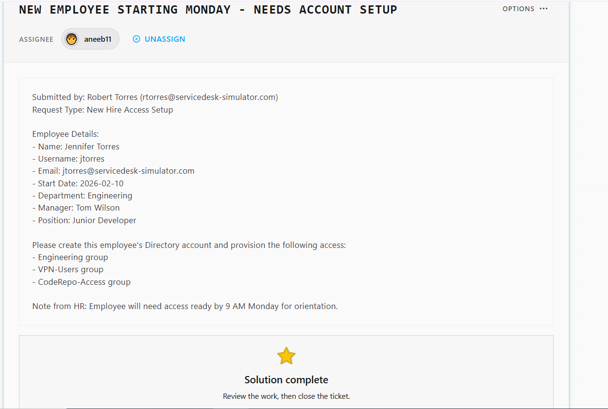

# Ticket Resolution: INC0012853 - New Hire Account Setup (Jennifer Torres)

**Assignee:** aneeb11
**Submitted by:** Robert Torres (rtorres@servicedesk-simulator.com)
**Priority:** Medium
**Request Type:** New Hire Access Setup
**Date Resolved:** 2026-08-04

## Request Description

New employee starting Monday, needs Directory account and access provisioned before 9 AM for orientation.

**Employee Details:**
- Name: Jennifer Torres
- Username: jtorres
- Email: jtorres@servicedesk-simulator.com
- Start Date: 2026-02-10
- Department: Engineering
- Manager: Tom Wilson
- Position: Junior Developer

**Access Requested:**
- Engineering group
- VPN-Users group
- CodeRepo-Access group

## Resolution Steps Taken

### 1. Checked for an existing account

Searched Directory for Jennifer Torres to confirm no duplicate account already existed.

### 2. Created the account

Clicked Add New User and entered the employee details (username, email, department, manager, position).

### 3. Checked current group memberships

Opened Groups and reviewed the account's group memberships before making changes.

### 4. Provisioned access

Added the account to the Engineering, VPN-Users, and CodeRepo-Access groups as requested.

### 5. Confirmed with requester

Notified Robert over Team Chat that the account and access were ready ahead of Monday's start date.

## Outcome

Resolved -> Directory account created for Jennifer Torres and added to Engineering, VPN-Users, and CodeRepo-Access groups, ready before Monday's 9 AM orientation.

