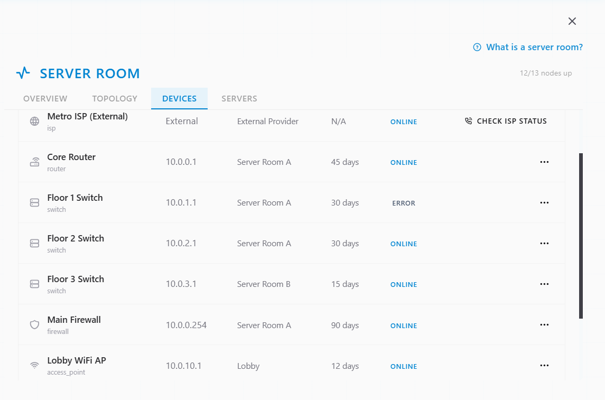
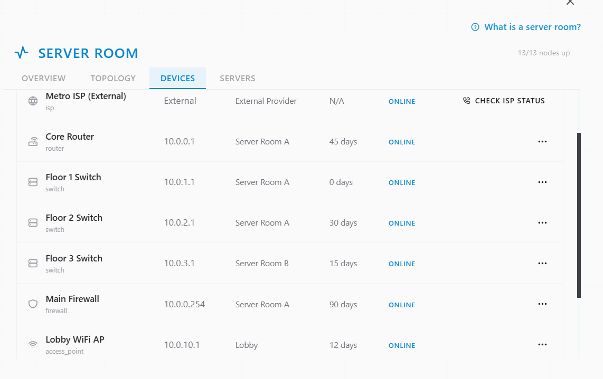
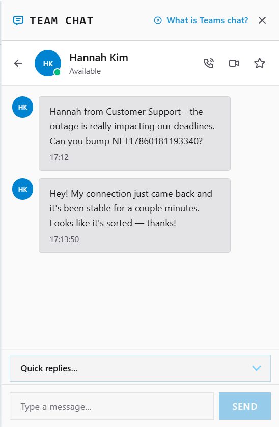
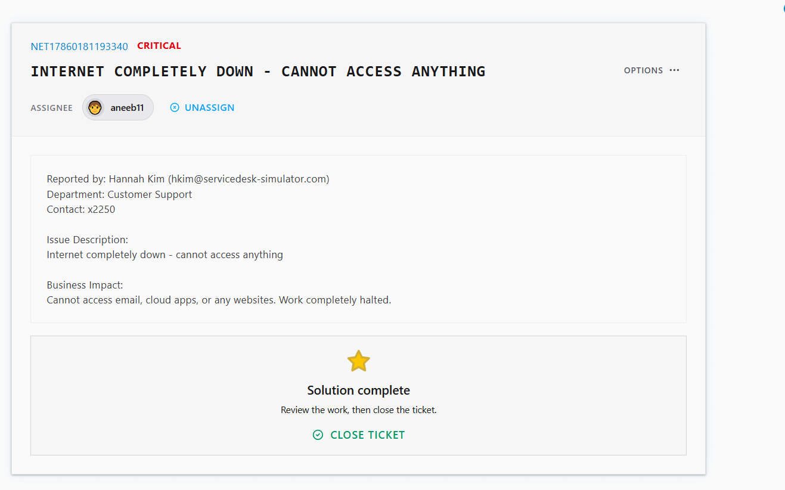

# Ticket Resolution: INC0012867 - Internet Outage

**Assignee:** aneeb11  
**Submitted by:** Hannah Kim (hkim@servicedesk-simulator.com)  
**Priority:** Critical  
**Request Type:** Network Infrastructure  
**Date Resolved:** 2026-08-05  

## Request Description

Internet completely down across department. Users cannot access email, cloud applications, or any external websites. Work halted.

**Issue Details:**
- Scope: Complete internet outage
- Impact: Email inaccessible, cloud apps down, all web services unavailable
- Users affected: Multiple (Customer Support department minimum)
- Business impact: Operations halted

## Diagnostic Thinking

### What This Means

Internet completely inaccessible across a department suggests network infrastructure failure, not individual user issues. Possible points of failure:

**Most Likely:**
- Network switch failure or crash
- Router misconfiguration
- ISP connection down
- Local network device (switch/router) unresponsive

**Less Likely:**
- DNS failure (would still allow some connectivity)
- Firewall configuration change
- Multiple simultaneous user connection drops

### Investigation Approach

Critical outage requires checking server room network infrastructure first — switches, routers, and ISP connection status. A switch in error state or offline would block all department traffic.

## Resolution Steps Taken

### 1. Located network infrastructure

Accessed tools > server room > devices to view network hardware status.

### 2. Identified the problem

Floor 1 switch was showing error state, indicating device failure or crash.

### 3. Recovered the device

Rebooted the switch to clear the error condition and restore normal operation.

### 4. Confirmed with user

Notified Hannah Kim in Team Chat that internet connectivity is restored and all services are back online.

## Outcome

Resolved -> Floor 1 network switch was in error state and rebooted successfully. Internet connectivity fully restored. All departments can now access email, cloud apps, and web services.

