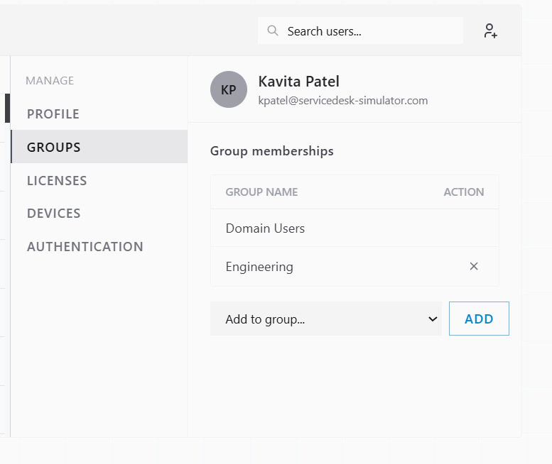
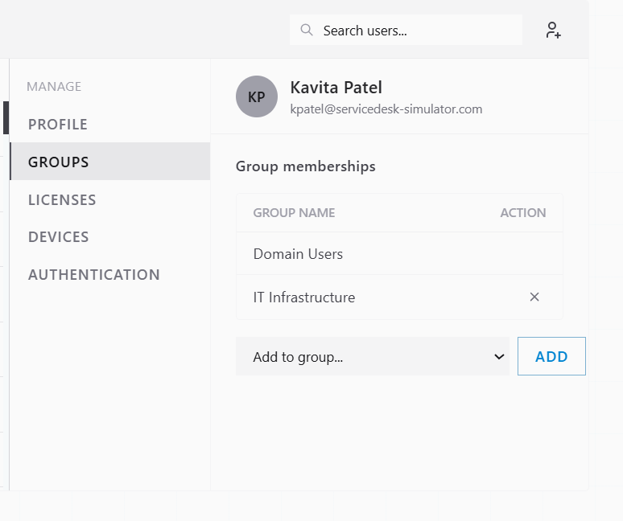
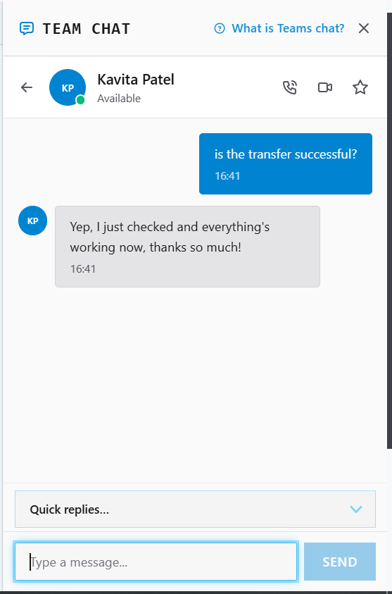
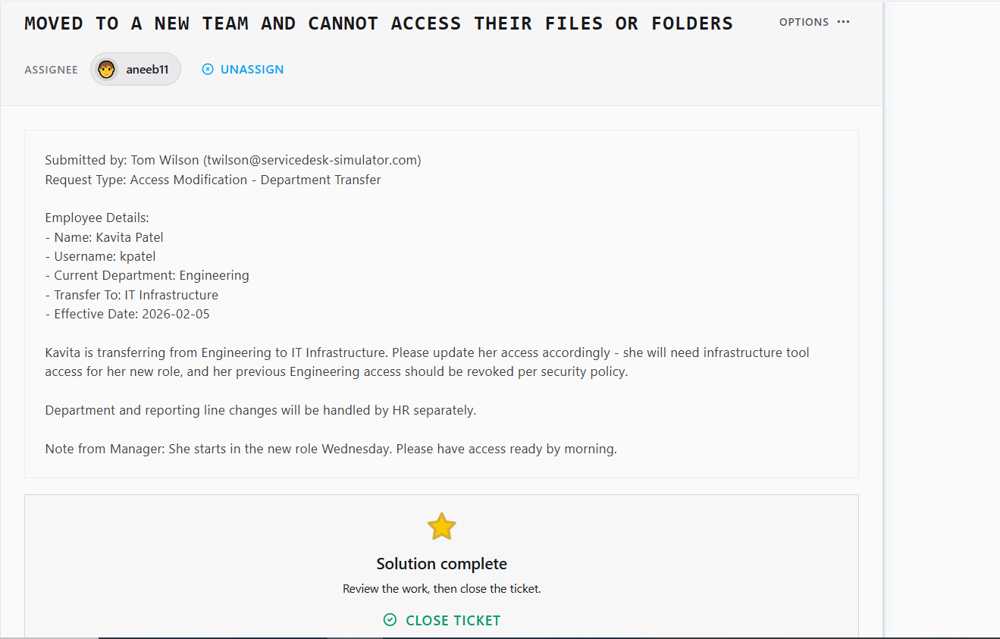

# Ticket Resolution: INC0012860 -> Department Transfer Access Update

**Assignee:** aneeb11  
**Submitted by:** Tom Wilson (twilson@servicedesk-simulator.com)  
**Priority:** Medium  
**Request Type:** Access Modification - Department Transfer  
**Date Resolved:** 2026-08-05  

## Request Description

Employee transferring between departments requires access changes. Previous department access must be revoked per security policy and new department access provisioned.

**Employee Details:**
- Name: Kavita Patel
- Username: kpatel
- Current Department: Engineering
- Transfer To: IT Infrastructure
- Effective Date: 2026-02-05
- Start Date in New Role: Wednesday morning

**Access Changes Needed:**
- Remove: Engineering group access
- Add: IT Infrastructure group access and infrastructure tool access

## Resolution Steps Taken

### 1. Searched and opened Kavita's account

Located Kavita Patel in directory tools and reviewed her profile.

### 2. Removed Engineering group access

Checked her current group memberships and removed her from Engineering group.

### 3. Added IT Infrastructure group access

Added Kavita to IT Infrastructure group to grant infrastructure tool access for her new role.

### 4. Confirmed with requester

Notified Tom Wilson in Team Chat that access changes are complete and ready for Wednesday start.

## Outcome

Resolved -> Kavita Patel's access updated for department transfer. Removed from Engineering group, added to IT Infrastructure group. Access ready for Wednesday morning start.

