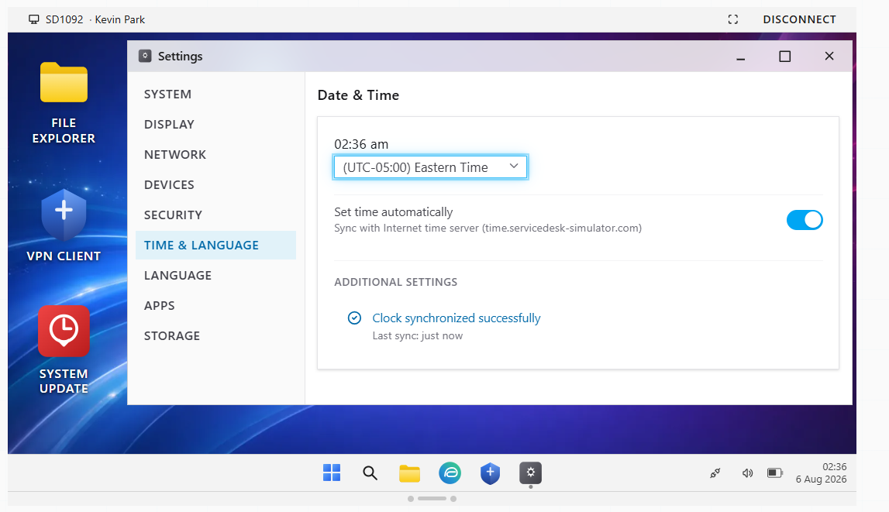
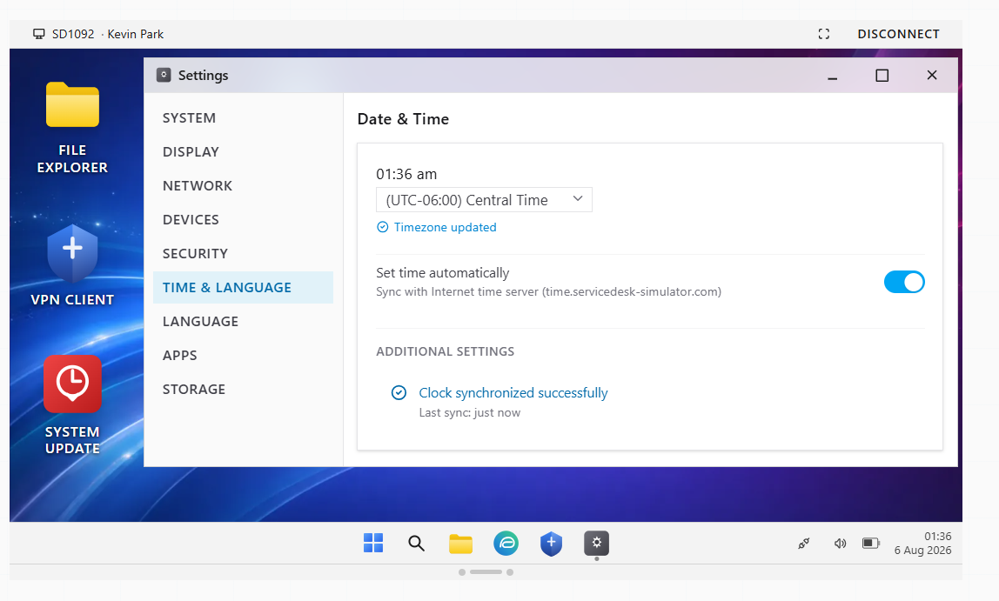
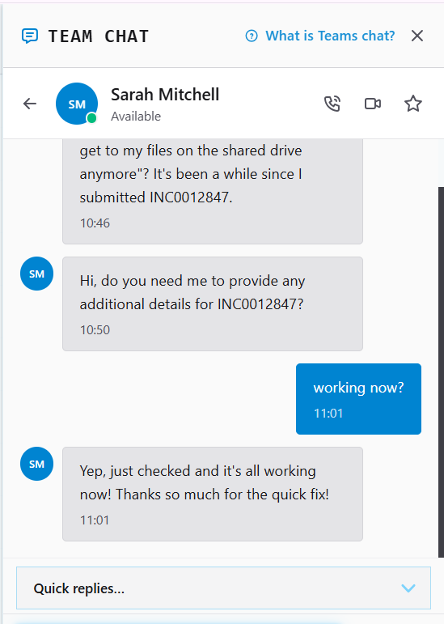
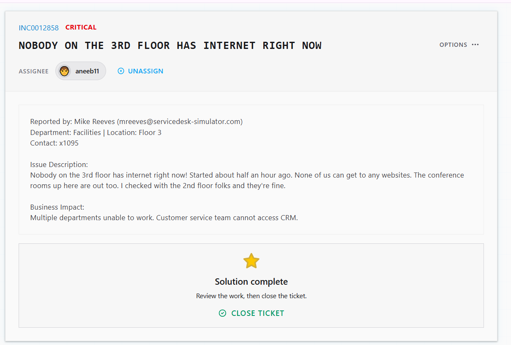

# Ticket Resolution: INC0012865 - Timezone Configuration Issue

**Assignee:** aneeb11  
**Submitted by:** Kevin Park (kpark@servicedesk-simulator.com)  
**Priority:** High  
**Request Type:** System Configuration  
**Date Resolved:** 2026-08-05  

## Request Description

User's computer clock is set to Eastern timezone instead of Central timezone, causing Team Chat meetings to display incorrect times. User already missed one meeting and has three more scheduled this afternoon.

**Issue Details:**
- Computer timezone: Eastern (incorrect)
- Correct timezone: Central
- Business impact: Missed meetings, incorrect file timestamps
- User troubleshooting: Restarted computer (no change)

## Resolution Steps Taken

### 1. Connected to user's computer

Used Remote Desktop to connect to Kevin Park's PC for remote troubleshooting.

### 2. Accessed timezone settings

Opened Settings > Time & Language to check current timezone configuration.

### 3. Changed timezone

Updated timezone setting from Eastern to Central.

### 4. Confirmed with user

Notified Kevin in Team Chat that the timezone has been corrected and all meetings now display at correct times.

## Outcome

Resolved -> Computer timezone changed from Eastern to Central. System clock now displays correct time. All Team Chat meetings showing correct times. User confirmed resolution.

