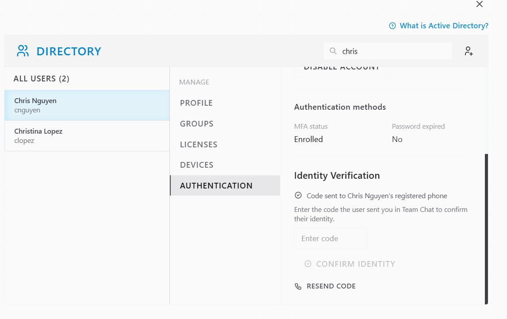
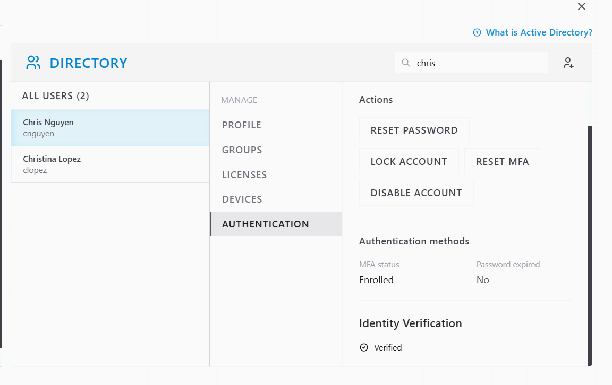
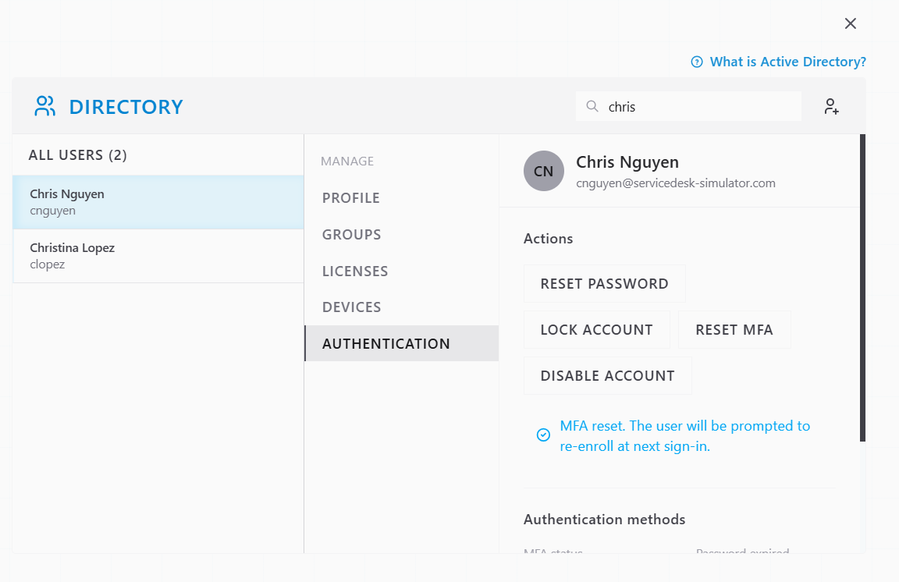
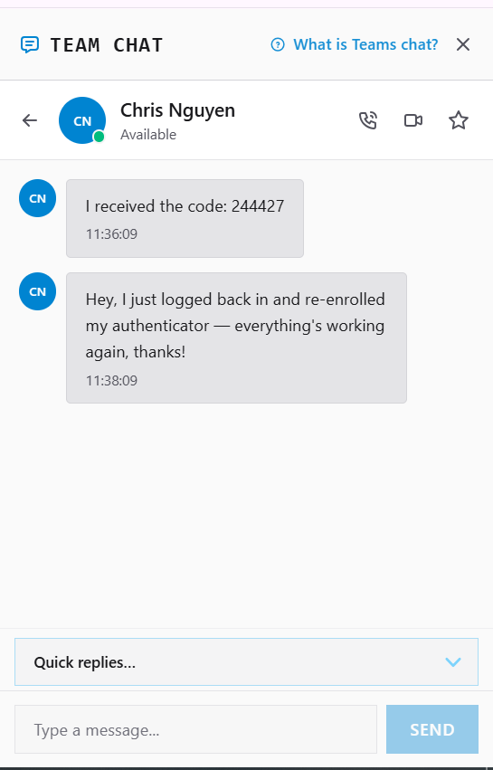
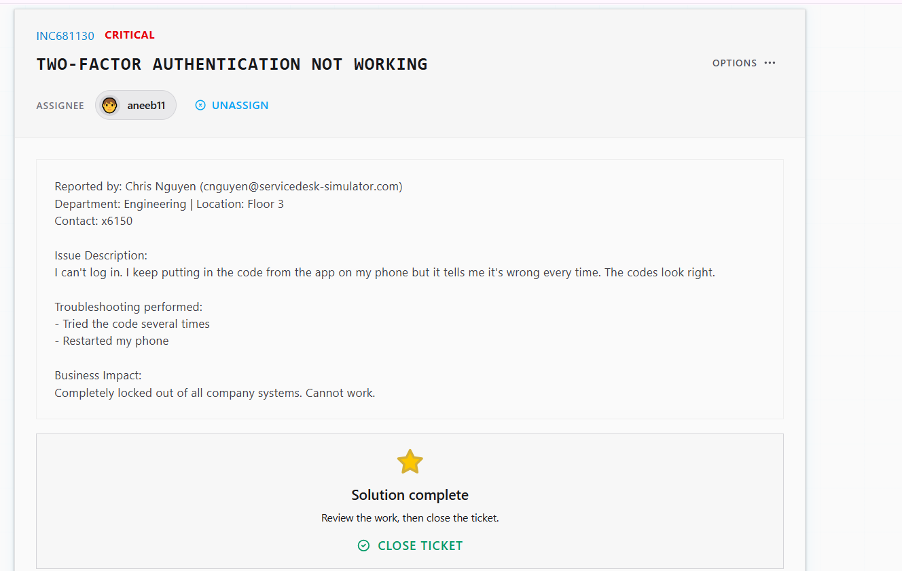

# Ticket Resolution: INC681130 - Two-Factor Authentication Failure

**Assignee:** aneeb11  
**Submitted by:** Chris Nguyen (cnguyen@servicedesk-simulator.com)  
**Priority:** Critical  
**Request Type:** Authentication - MFA Issue  
**Date Resolved:** 2026-08-07  

## Request Description

User completely locked out of company systems. Two-factor authentication codes from authenticator app are rejected as invalid, even though codes appear correct. User has tried multiple times and restarted phone.

**Issue Details:**
- Login attempt: Blocked by MFA
- MFA codes: Consistently rejected as invalid
- User troubleshooting: Retried codes multiple times, restarted phone
- Business impact: Complete system lockout, cannot work

## Diagnostic Thinking

### What This Means

MFA codes being rejected consistently despite appearing correct indicates a synchronization or binding issue between the authenticator app and the authentication server.

**Possible Causes:**

1. **Time sync issue** -> Authenticator app and server clocks out of sync (TOTP relies on exact time)
2. **Corrupted authenticator binding** -> Server database has wrong authenticator secret
3. **Stale app data** -> Authenticator app has outdated token
4. **Account lockout** -> Account temporarily locked after failed attempts

**Why MFA Reset is the Right Fix:**

If the authenticator binding is corrupted or out of sync, restarting the phone alone won't fix it. The server still has the wrong or stale authenticator secret. Resetting MFA clears the binding on the server side and forces re-enrollment with fresh binding and time sync.

## Resolution Steps Taken

### 1. Located user account in Directory

Searched for Chris Nguyen and opened his profile and authentication settings.

### 2. Requested identity verification code

Initiated identity verification sending code to Chris's phone.

### 3. Received and entered verification code

Chris provided the verification code he received. Entered the code to confirm his identity.

### 4. Reset MFA

After identity verification, reset MFA to clear corrupted authenticator binding and enable fresh re-enrollment.

### 5. Confirmed with user

Notified Chris in Team Chat that MFA has been reset. He re-enrolled his authenticator app and confirmed system access restored.

## Outcome

Resolved -> MFA binding was corrupted. Reset MFA forced re-enrollment with fresh authenticator synchronization. Chris logged back in, re-enrolled authenticator app, and can now access all company systems. 2FA working correctly.

