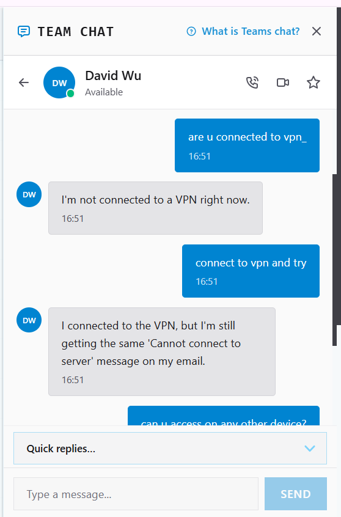
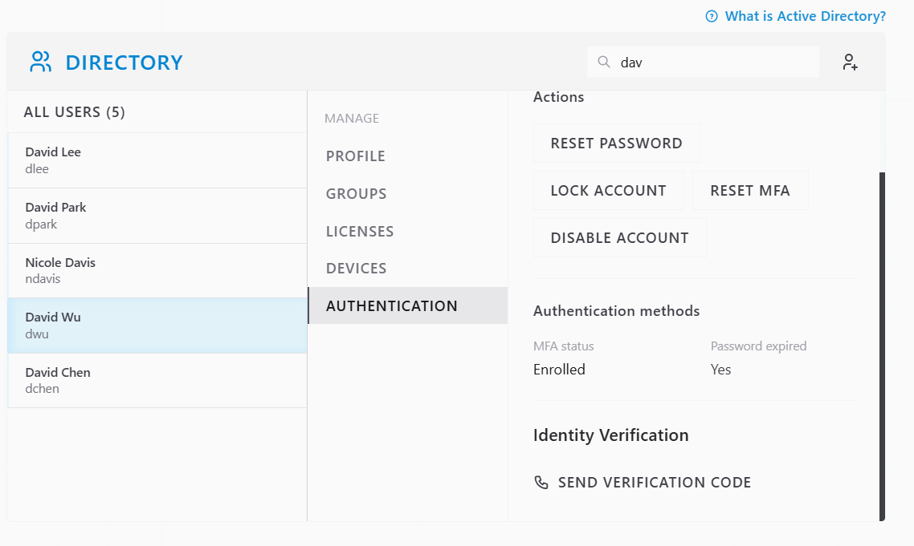
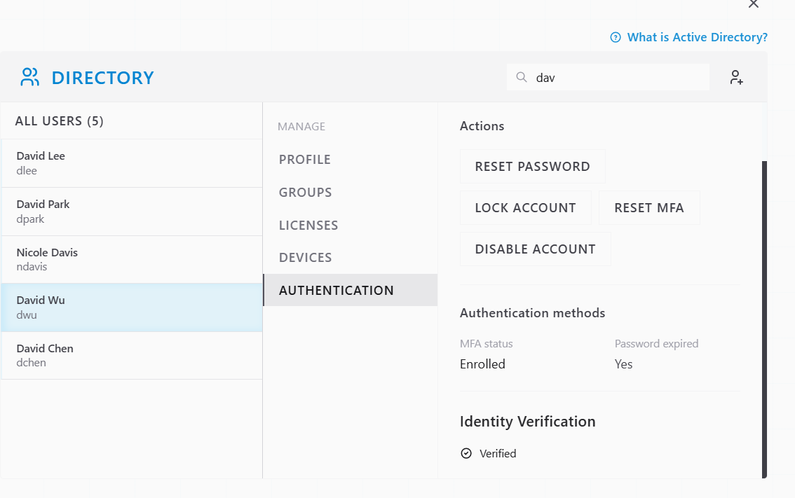
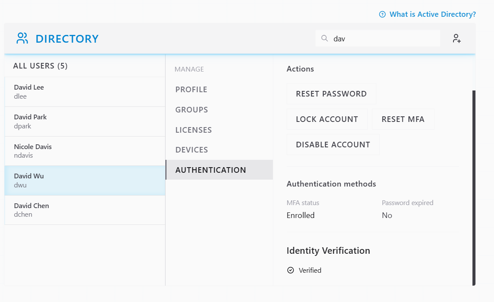
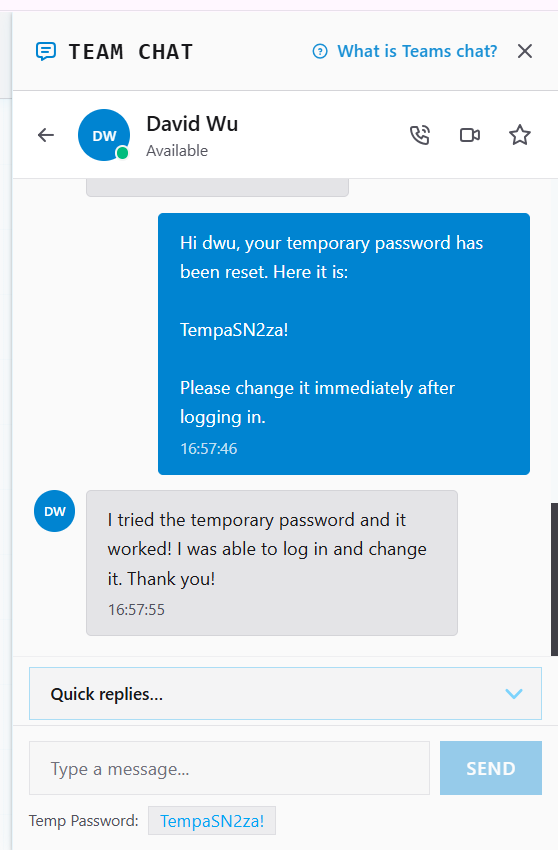
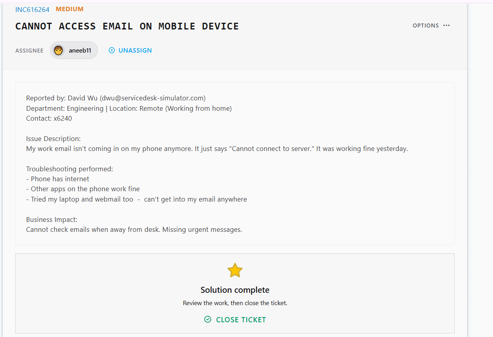

# Ticket Resolution: INC616264 - Email Access Failure Across Devices

**Assignee:** aneeb11  
**Submitted by:** David Wu (dwu@servicedesk-simulator.com)  
**Priority:** Medium  
**Request Type:** Email Access Issue  
**Date Resolved:** 2026-08-07  

## Request Description

User cannot access email on mobile device. Error shows "Cannot connect to server." Issue started today after working fine yesterday. Cannot access email on phone, laptop, or webmail.

**Issue Details:**
- Mobile email: Cannot connect to server
- Laptop email: Cannot access
- Webmail: Cannot access
- Phone connectivity: Working fine
- Other apps: Working fine
- Business impact: Missing urgent messages while away from desk

## Diagnostic Thinking

### What This Means

Email failing on multiple devices (phone, laptop, webmail) at the same time strongly suggests authentication issue, not VPN/network connectivity.

**Why It's Not a VPN Problem:**

If VPN was down, only remote access would fail. But the issue affects:
- Mobile on cellular (not VPN)
- Webmail (doesn't require VPN)
- Laptop (multiple access methods)

This pattern points to account-level authentication failure, not network connectivity.

**Likely Cause:**

Password expired. When password expires, all authentication attempts fail across all platforms simultaneously.

## Resolution Steps Taken

### 1. Initial troubleshooting - VPN hypothesis

Discussed with user and requested VPN connection to rule out network issues.

### 2. Located user account in Directory

Opened David Wu's profile and checked authentication status.

### 3. Verified user identity

Sent verification code to user's phone. User provided code to confirm identity before password reset.

### 4. Reset password

Clicked RESET PASSWORD and generated temporary password for user.

### 5. User confirmed access restored

Sent temporary password to David via chat. User confirmed email is now accessible on all devices.

## Outcome

Resolved -> User's password had expired, causing authentication failure across all email access methods. Password reset with temporary credential restored access. David can now check email on mobile, laptop, and webmail. Access confirmed working.

