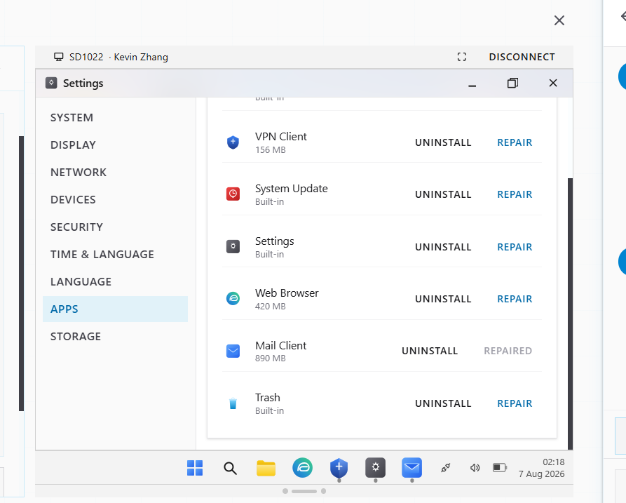
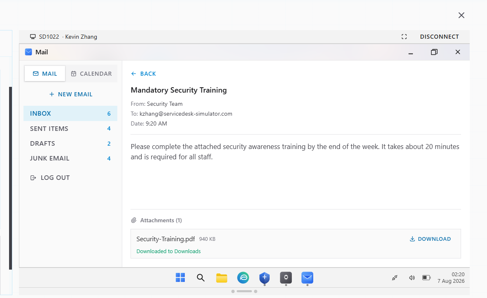

# Ticket Resolution: INC588750 - Email Attachment Download Failure

**Assignee:** aneeb11  
**Submitted by:** Kevin Zhang (kzhang@servicedesk-simulator.com)  
**Priority:** High  
**Request Type:** Mail Client Issue  
**Date Resolved:** 2026-08-07  

## Request Description

Email client receives messages normally but attachment downloads fail silently. User gets error when attempting to open attachments. Cannot access contracts clients are sending.

**Issue Details:**
- Email reception: Working
- Attachment downloads: Failing (nothing happens or error occurs)
- User troubleshooting: Clicked attachments multiple times, restarted Mail client
- Business impact: Cannot access important client contracts

## Diagnostic Thinking

### What This Means

Attachments not downloading while email reception works normally indicates Mail Client application corruption.

**Why Mail Client is the Issue:**

Emails arriving successfully means network connectivity and mail server connection work. If attachments won't download, the problem is within the Mail Client application itself — likely corrupted files or missing components responsible for handling file downloads.

**Solution Strategy:**

Repair the Mail Client application to restore attachment download functionality.

## Resolution Steps Taken

### 1. Connected to user's computer

Established Remote Desktop connection to Kevin Zhang's workstation to diagnose and repair.

### 2. Accessed application settings

Opened Settings > Apps to review installed applications and their status.

### 3. Repaired Mail Client

Clicked REPAIR button on Mail Client application to fix corrupted components preventing attachments from downloading.

### 4. Verified attachment downloads

Checked Mail client to confirm attachments now download and open successfully.

### 5. Confirmed with user

Notified Kevin in Team Chat that attachment downloads are now functional.

## Outcome

Resolved -> Mail Client application was corrupted, preventing attachment downloads. Repair operation restored functionality. Email attachments now download and open without errors. Kevin can access client contracts.

