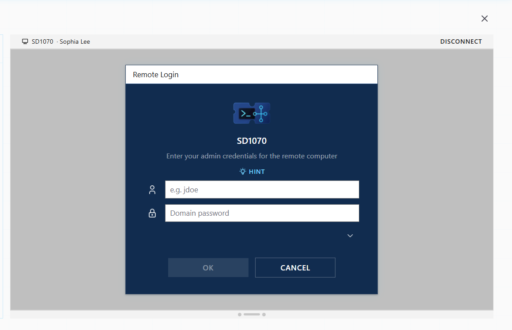
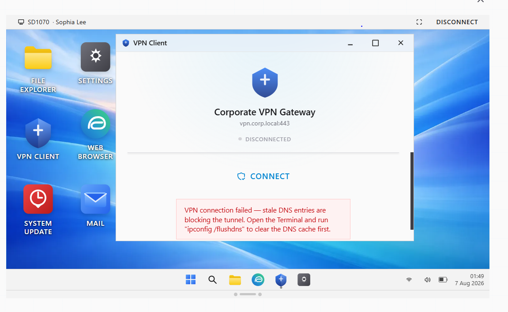
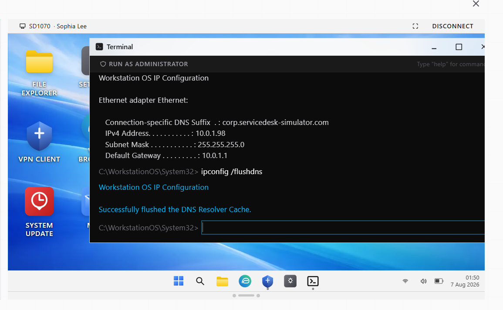
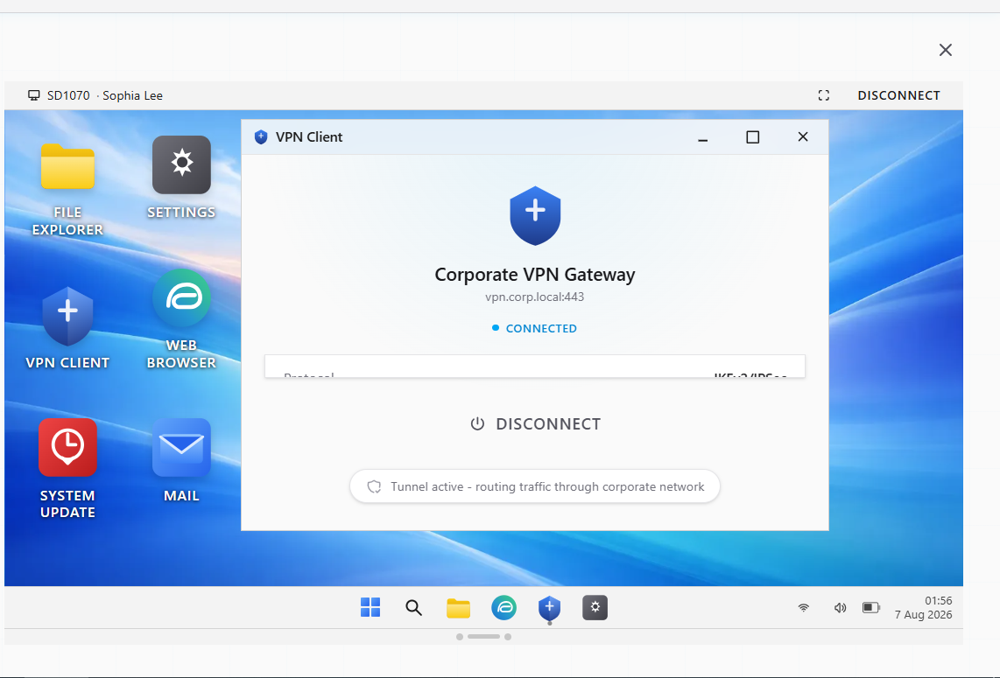
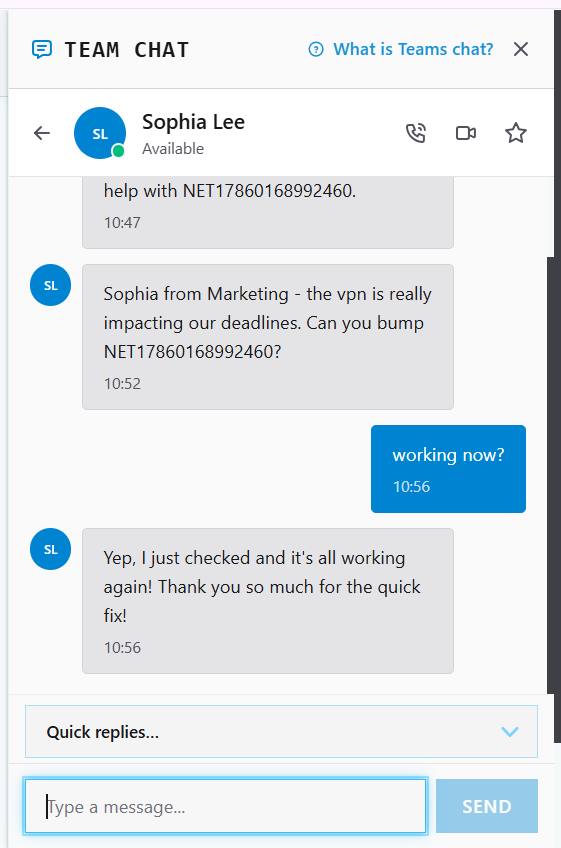
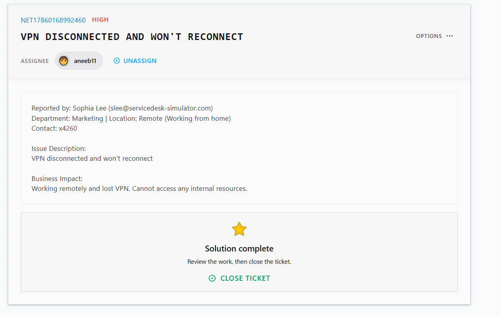

# Ticket Resolution: NET17860168992460 - VPN Connection Failure

**Assignee:** aneeb11  
**Submitted by:** Sophia Lee (slee@servicedesk-simulator.com)  
**Priority:** High  
**Request Type:** Remote Access - VPN  
**Date Resolved:** 2026-08-07  

## Request Description

Remote employee lost VPN connection and cannot reconnect. Cannot access internal resources from home. Work halted until VPN restored.

**Issue Details:**
- VPN status: Disconnected, reconnect failing
- User location: Remote (working from home)
- Access lost: All internal resources
- Business impact: Remote work blocked until resolved

## Diagnostic Thinking

### What This Means

VPN won't reconnect typically indicates either gateway issues or client-side configuration problems. The VPN client error message is key here.

**Error Message Analysis:**

The VPN client displayed: "VPN connection failed — stale DNS entries are blocking the tunnel. Open the Terminal and run 'ipconfig /flushdns' to clear the DNS cache first."

This tells us:
- DNS cache on the local machine contains outdated entries
- Old DNS records pointing to wrong VPN gateway endpoint
- VPN client can't reach gateway due to stale DNS resolution
- Solution: Clear local DNS cache to force fresh DNS lookups

**Root Cause:** Cached DNS entries from previous network connections preventing VPN tunnel establishment.

## Resolution Steps Taken

### 1. Connected to remote computer

Established Remote Desktop connection to Sophia's workstation to troubleshoot directly.

### 2. Identified VPN error state

Checked VPN Client status showing disconnected state with DNS cache error message.

### 3. Cleared DNS cache

Opened Terminal and ran `ipconfig /flushdns` command to clear stale DNS entries from system cache.

### 4. Reconnected VPN

VPN Client automatically reconnected after DNS cache was cleared. Tunnel now active.

### 5. Confirmed with user

Notified Sophia via Team Chat that VPN is working and internal resources accessible.

## Outcome

Resolved -> VPN connection restored by clearing DNS resolver cache. Sophia can now access internal resources remotely. Tunnel active and routing traffic through corporate network.

