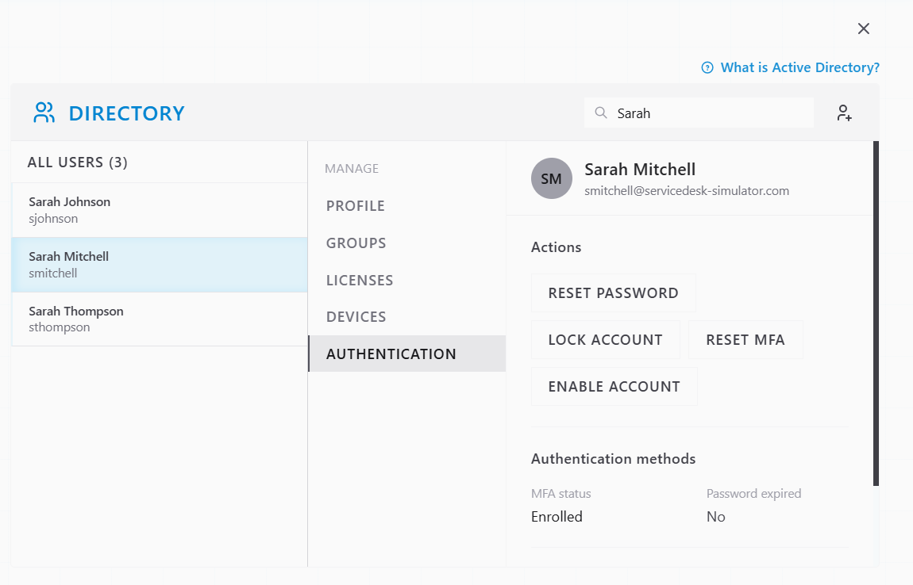
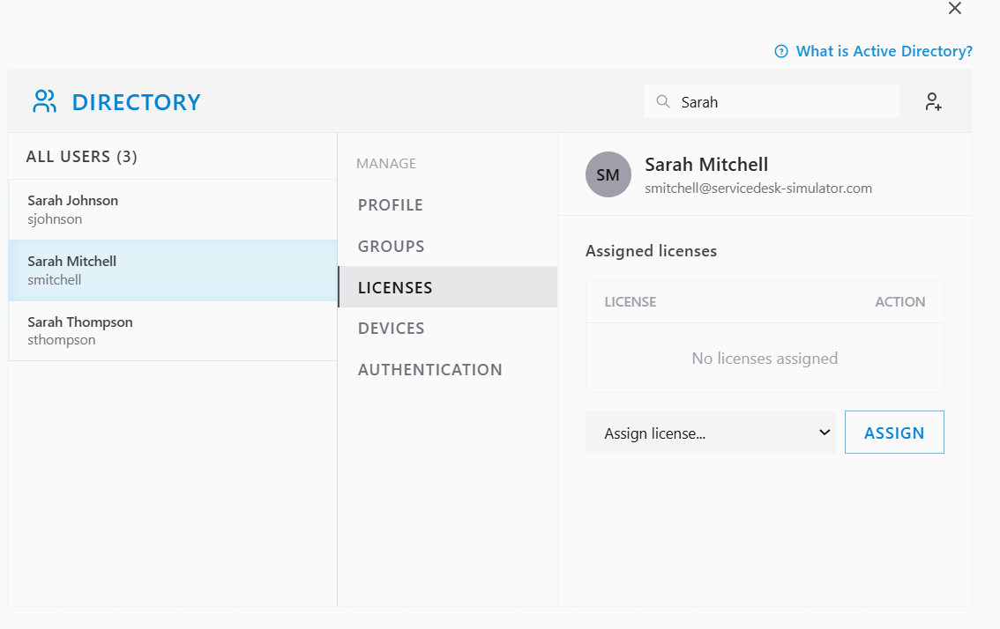
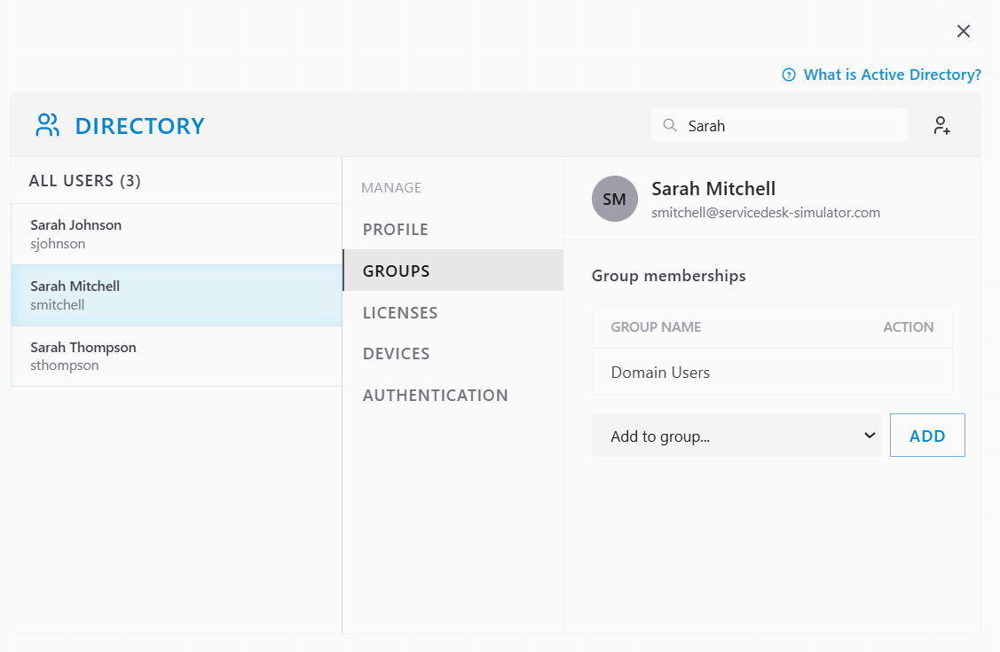
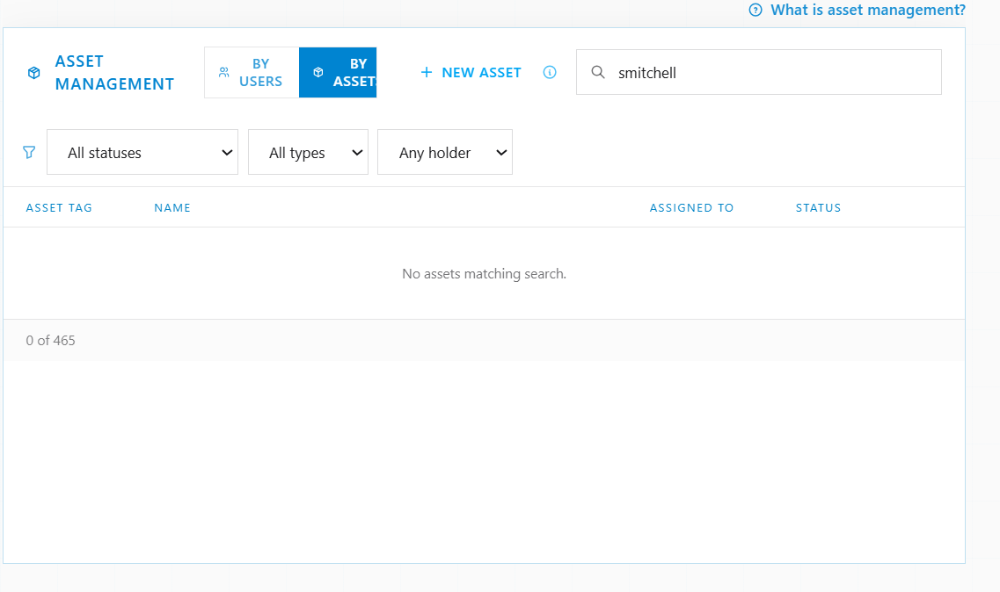
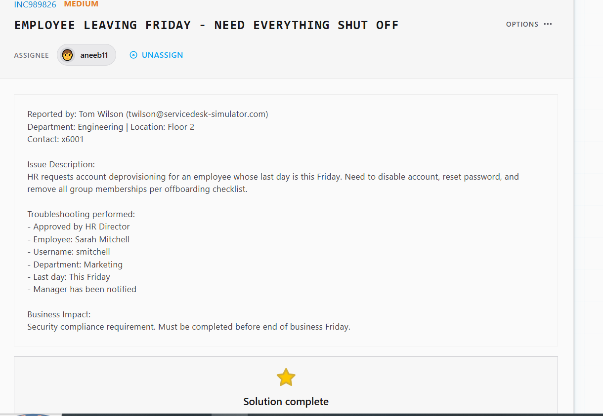

# Ticket Resolution: INC989826 - Employee Offboarding - Account Deprovisioning

**Assignee:** aneeb11  
**Submitted by:** Tom Wilson (twilson@servicedesk-simulator.com)  
**Priority:** Medium  
**Request Type:** Account Deprovisioning - Offboarding  
**Date Resolved:** 2026-08-08  

## Request Description

HR requests complete account deprovisioning for departing employee. Account must be disabled, password reset, all group memberships removed, and assets recalled per security compliance offboarding checklist. Employee last day is Friday.

**Employee Details:**
- Name: Sarah Mitchell
- Username: smitchell
- Department: Marketing
- Last day: Friday
- Approvals: HR Director approved, manager notified

## Diagnostic Thinking

### What This Means

Employee offboarding is a security compliance procedure that requires systematic account shutdown and access revocation. Must be completed before employee's last day to prevent unauthorized access.

**Security Considerations:**

Offboarding involves multiple steps that must all be completed to fully revoke access:
- Account disable prevents login
- Password reset prevents credential reuse
- License removal revokes software access
- Group removal revokes resource access
- Asset recall prevents data loss on company equipment

All steps must be documented for compliance audit trail.

## Resolution Steps Taken

### 1. Located employee account

Searched Directory for Sarah Mitchell and opened her account.

### 2. Disabled account and reset password

Opened Authentication tab and reset password to prevent any login. Account status now disabled.

### 3. Removed all licenses

Opened Licenses tab and verified no licenses assigned to Sarah's account.

### 4. Removed all group memberships

Opened Groups tab and removed Sarah from all groups except Domain Users.

### 5. Recalled all assigned assets

Opened Asset Management and searched for Sarah's assigned equipment. No assets currently showing (all equipment recalled or transfer process initiated).

## Outcome

Resolved -> Sarah Mitchell's account fully deprovisioned per offboarding checklist. Account disabled, password reset, all licenses removed, all group memberships removed, all assets recalled. Access completely revoked. Offboarding completed before Friday end of business. Compliance requirement met.

