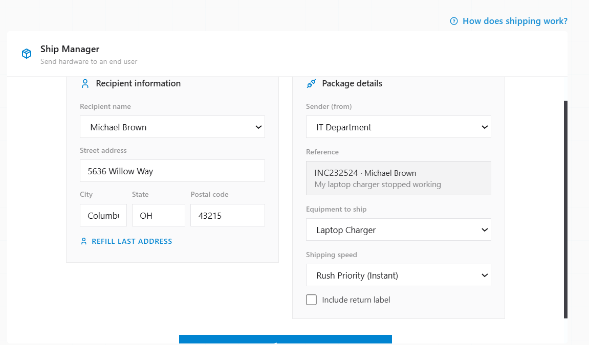
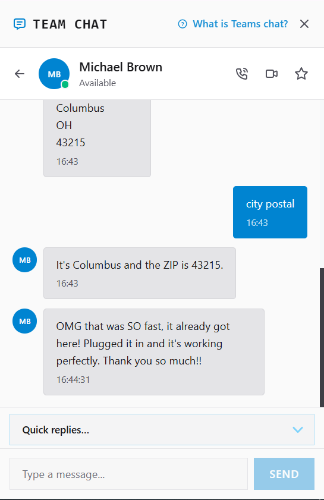
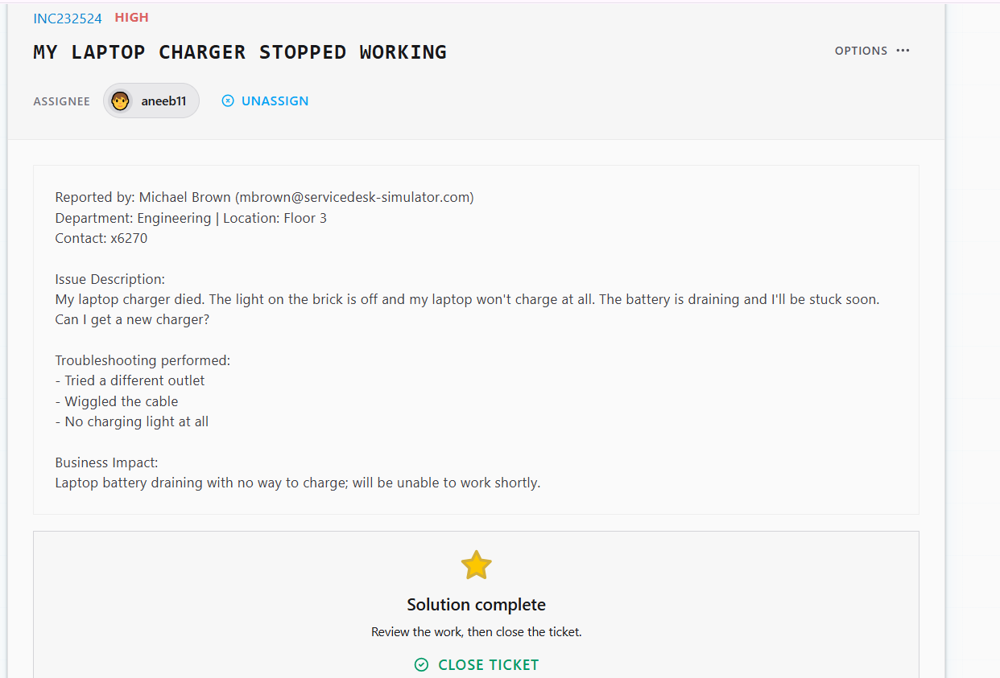

# Ticket Resolution: INC232524 - Laptop Charger Hardware Failure

**Assignee:** aneeb11  
**Submitted by:** Michael Brown (mbrown@servicedesk-simulator.com)  
**Priority:** High  
**Request Type:** Hardware Replacement  
**Date Resolved:** 2026-08-07  

## Request Description

Laptop charger died completely. Power brick indicator light is off and laptop won't charge. Battery draining with no way to power device. User needs replacement urgently.

**Issue Details:**
- Charger status: Dead (no indicator light)
- Laptop charging: Not charging at all
- Battery status: Draining
- Business impact: Will be unable to work shortly without power source

## Diagnostic Thinking

### What This Means

Charger completely unresponsive (no indicator light) after user tried different outlet indicates hardware failure of the power adapter.

**Why Outlet Switching Matters:**

When a charger shows no power indicator light, trying a different outlet helps distinguish between:
- Outlet failure (would work in different outlet)
- Charger failure (won't work in any outlet)

User confirmed different outlet didn't resolve it, so power brick is dead.

**Solution:**

Hardware is failed. Cannot be repaired. Replacement charger must be shipped to user to restore laptop functionality.

## Resolution Steps Taken

### 1. Initial troubleshooting

Asked user to test charger in different outlet to rule out outlet failure.

### 2. Confirmed hardware failure

Different outlet didn't resolve the issue. Power brick is dead and requires replacement.

### 3. Collected shipping address

Requested Michael's shipping address via Team Chat for hardware replacement.

### 4. Initiated hardware shipment

Opened Ship Manager and entered Michael's details. Selected Laptop Charger as equipment to ship with Rush Priority (same-day).

### 5. Confirmed with user

Notified Michael that replacement charger has been shipped with rush priority. Charger arrived same day and user confirmed it's working.

## Outcome

Resolved -> Laptop charger had hardware failure. Replacement charger shipped to Michael Brown at 5636 Willow Way, Columbus OH 43215 via rush priority. Charger received and working. Michael can now charge laptop normally.

