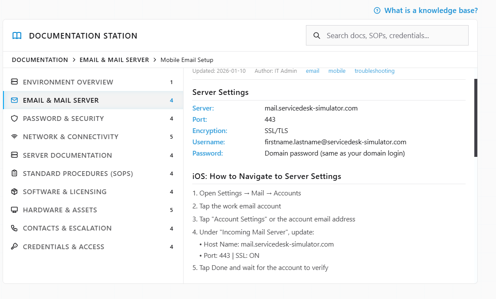
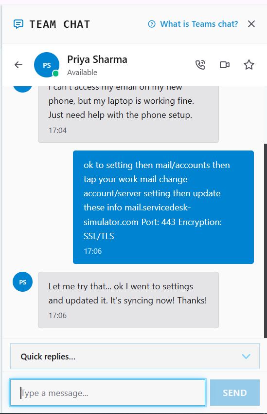
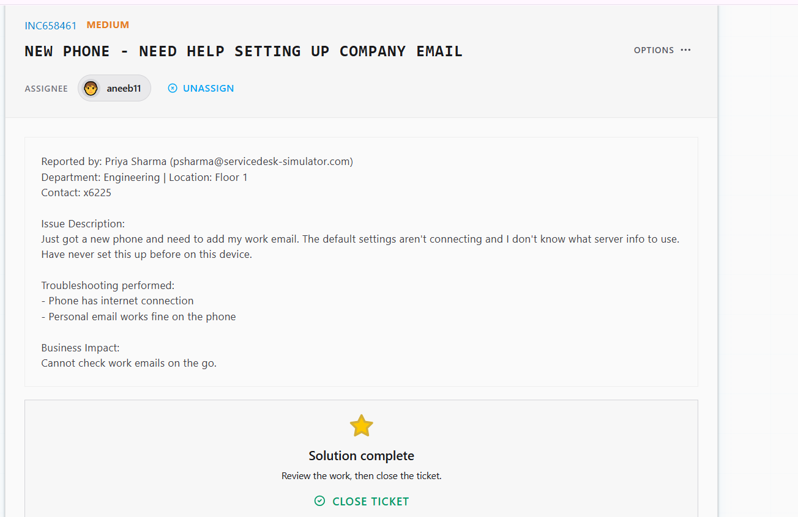

# Ticket Resolution: INC658461 - Mobile Email Setup for New Phone

**Assignee:** aneeb11  
**Submitted by:** Priya Sharma (psharma@servicedesk-simulator.com)  
**Priority:** Medium  
**Request Type:** Mobile Device Configuration  
**Date Resolved:** 2026-08-08  

## Request Description

User received new phone and cannot configure work email. Default email setup fails to connect. User doesn't know what server information to use. Never set up work email on a mobile device before.

**Issue Details:**
- Phone internet: Working
- Personal email: Syncing fine
- Work email: Cannot connect with default settings
- Business impact: Cannot check work emails while away from desk

## Diagnostic Thinking

### What This Means

Personal email working but work email failing with default settings indicates configuration problem, not connectivity or account issue.

**Why This Isn't an Account Problem:**

If the work email account had issues, it wouldn't work on the laptop either. But user confirmed work email is working fine on laptop.

**Root Cause:**

Mobile email client using wrong server settings. Different platforms (iOS vs Android vs desktop) often require different IMAP/SMTP configuration. User needs correct server details for mobile setup.

**Solution:**

Provide correct server settings (host, port, encryption type) from documentation and walk user through manual configuration.

## Resolution Steps Taken

### 1. Verified work email access

Asked user to confirm work email is accessible on laptop. Confirmed working fine on desktop.

### 2. Located server configuration documentation

Checked Documentation Station and found Mobile Email Setup guide with correct server settings.

### 3. Provided configuration details

Sent Priya the correct server settings for mobile setup via Team Chat.

### 4. User updated settings

Priya navigated to Settings > Mail > Accounts, updated server settings (host, port, SSL/TLS), and confirmed email now syncing.

## Outcome

Resolved -> Work email configured on new phone using correct server settings (mail.servicedesk-simulator.com, Port 443, SSL/TLS). Email syncing successfully. Priya can now check work emails on mobile.

