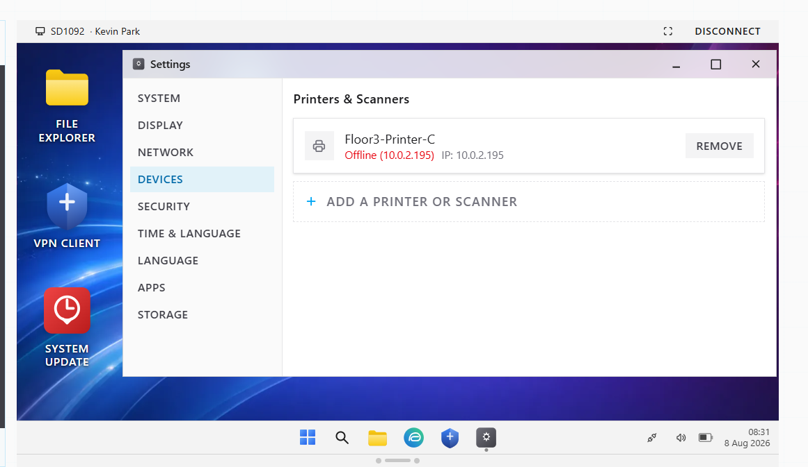
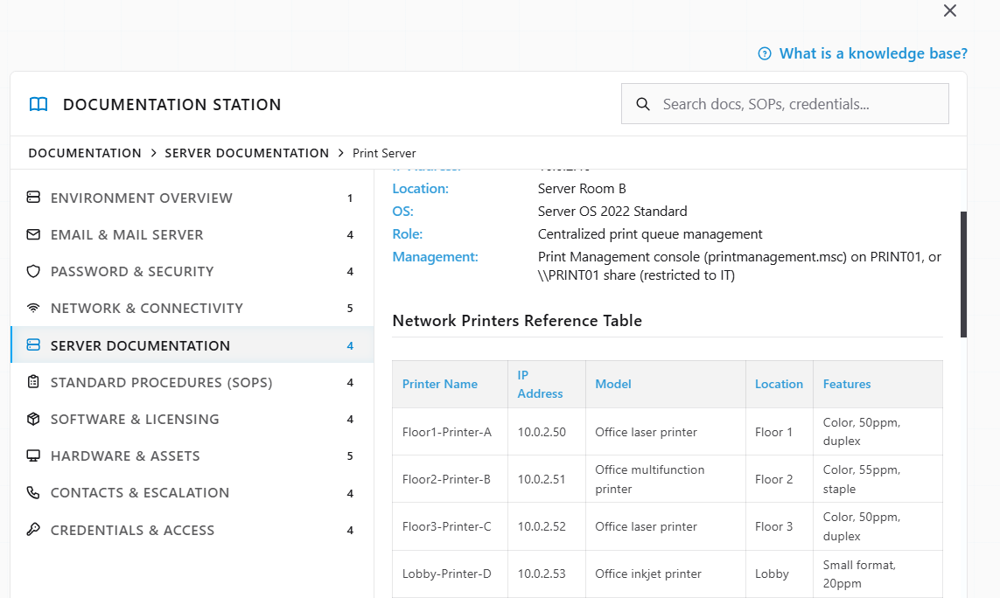
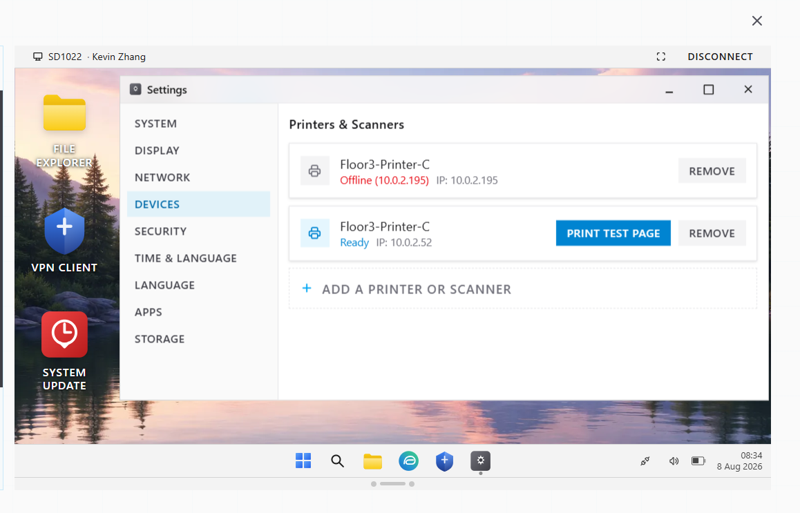
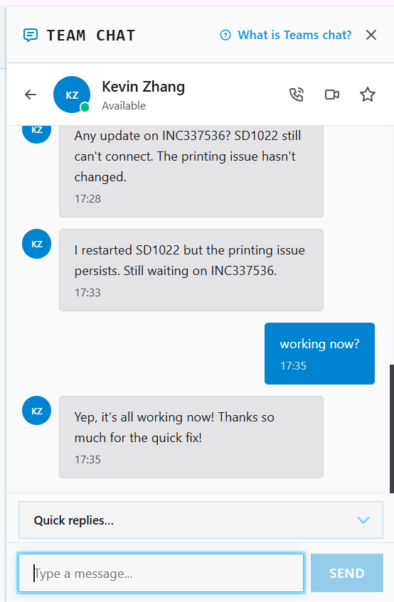
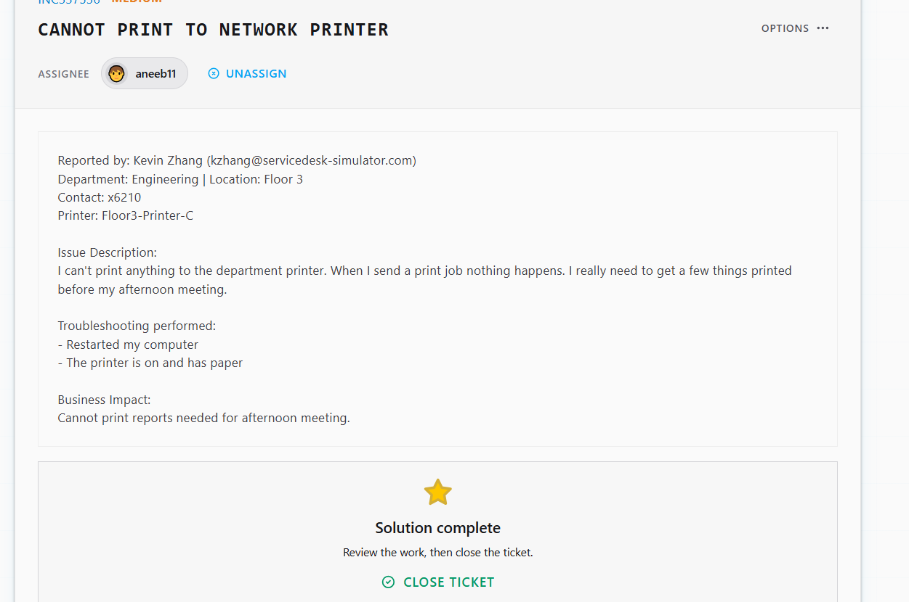

# Ticket Resolution: INC337536 - Network Printer Connectivity Failure

**Assignee:** aneeb11  
**Submitted by:** Kevin Zhang (kzhang@servicedesk-simulator.com)  
**Priority:** Medium  
**Request Type:** Printer Configuration  
**Date Resolved:** 2026-08-08  

## Request Description

User cannot print to department network printer. Print jobs fail silently. Printer is powered on with paper. User needs documents printed before afternoon meeting.

**Issue Details:**
- Printer: Floor3-Printer-C
- Status: Not responding to print jobs
- User troubleshooting: Restarted computer, verified printer is on and has paper
- Business impact: Cannot print reports needed for afternoon meeting

## Diagnostic Thinking

### What This Means

Computer restarted but printer still not responding suggests network connectivity issue between workstation and printer, not a local spooler problem.

**Why This Isn't a Spooler Issue:**

Restarting the computer clears the print spooler and any local driver state. If printing still fails after restart, the problem is likely:
- Wrong printer IP address configured
- Printer offline or unreachable
- Network misconfiguration

**Solution Strategy:**

Check the printer configuration on the workstation. If IP is wrong or stale, update it to the correct IP from documentation.

## Resolution Steps Taken

### 1. Connected remotely to user's computer

Established remote connection to Kevin's workstation to troubleshoot directly.

### 2. Identified printer configuration problem

Opened Settings > Devices > Printers & Scanners and found Floor3-Printer-C showing offline with wrong IP address (10.0.2.195).

### 3. Located correct printer IP

Checked Documentation Station for printer reference table and found correct IP for Floor3-Printer-C.

### 4. Updated printer configuration

Removed offline printer with incorrect IP and added printer with correct IP address (10.0.2.52).

### 5. Confirmed with user

Notified Kevin that printer is now connected and ready. Confirmed documents print successfully.

## Outcome

Resolved -> Floor3-Printer-C was configured with outdated IP address (10.0.2.195) causing offline status. Removed stale printer entry and added with correct IP (10.0.2.52). Printer now responsive and printing. Kevin can print reports for afternoon meeting.

