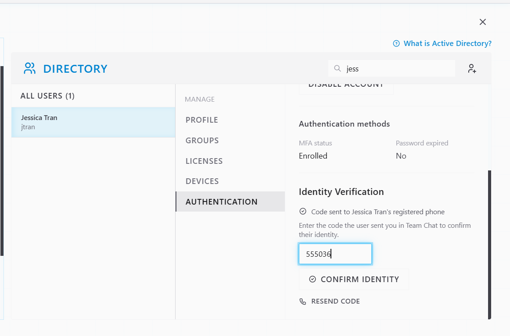
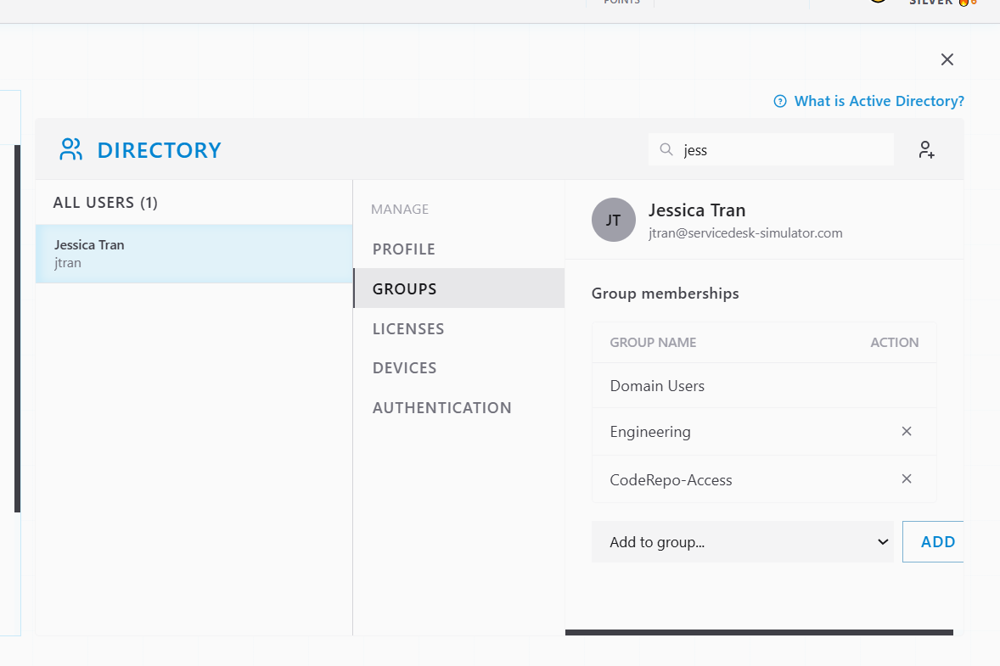
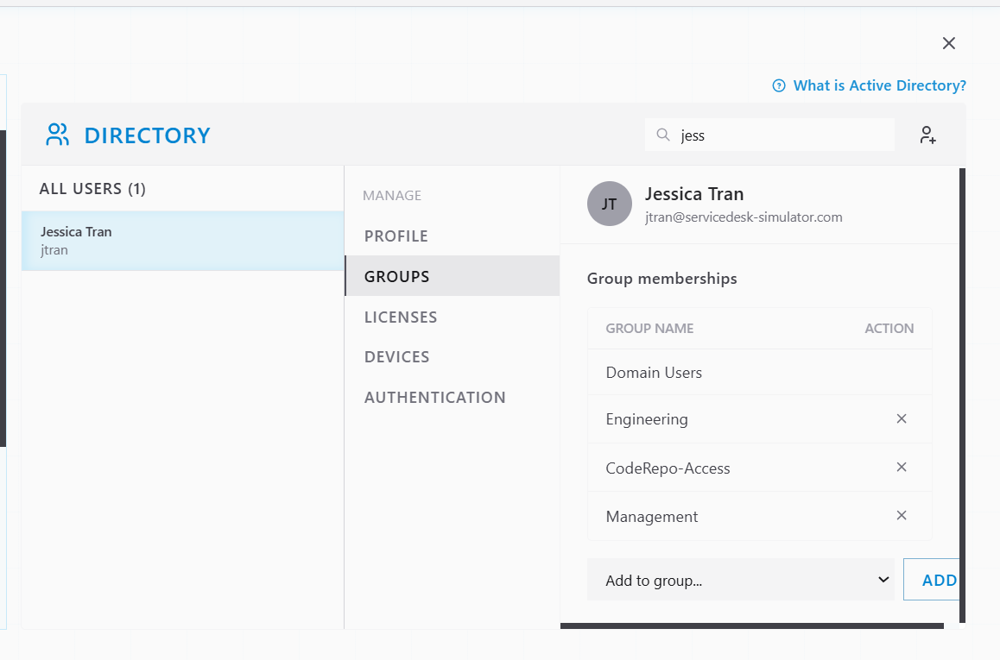
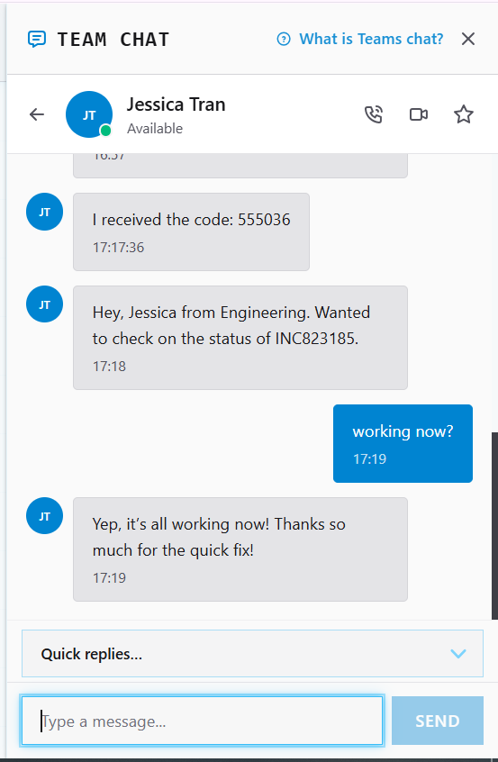
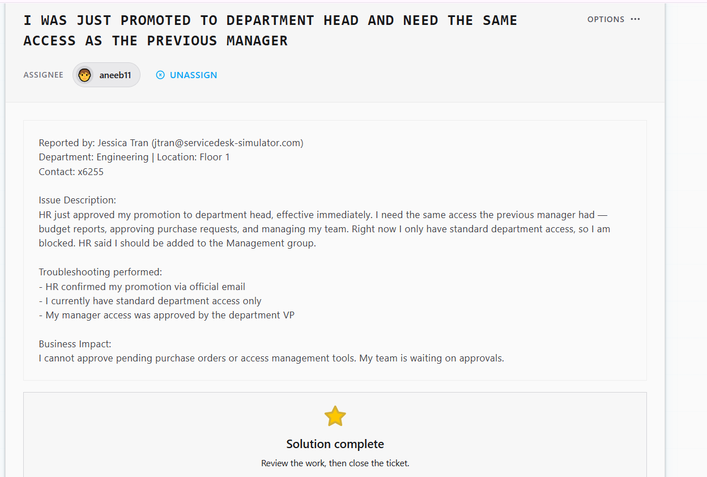

# Ticket Resolution: INC823185 - Promotion Access Upgrade

**Assignee:** aneeb11  
**Submitted by:** Jessica Tran (jtran@servicedesk-simulator.com)  
**Priority:** High  
**Request Type:** Access Modification - Promotion  
**Date Resolved:** 2026-08-08  

## Request Description

User promoted to department head effective immediately. Needs management-level access to perform new role responsibilities. Currently blocked from budget reports, purchase approvals, and team management tools with standard department access only.

**Issue Details:**
- Promotion: Department head (approved by HR and VP)
- Current access: Standard department access only
- Required access: Management group (budget reports, purchase approvals, team management)
- Business impact: Cannot approve pending purchase orders; team waiting on approvals

## Diagnostic Thinking

### What This Means

Role promotion means access permissions need to be elevated to match new responsibilities. This is a legitimate access change request with proper authorization chain.

**Why Identity Verification Matters:**

Before elevating privileges to management level, verify user identity. Even with HR email confirmation, verifying the actual person requesting the change is a security best practice for privilege escalation.

**Why Management Group Access is Correct:**

HR explicitly stated Management group access is needed. This role change affects budget authority and team management, so group membership is the right approach.

## Resolution Steps Taken

### 1. Located user account in Directory

Searched for Jessica Tran and opened her account profile.

### 2. Verified user identity

Sent verification code to Jessica's registered phone to confirm identity before privilege escalation.

### 3. Reviewed current group memberships

Checked Jessica's current groups before making changes.

### 4. Added Management group access

Added Jessica to Management group to grant budget report, purchase approval, and team management permissions.

### 5. Confirmed with user

Notified Jessica via Team Chat that management access is now active and she can access all required tools.

## Outcome

Resolved -> Jessica Tran promoted to department head with Management group access added. She now has access to budget reports, purchase approval tools, and team management functions. Pending purchase orders can now be approved.

