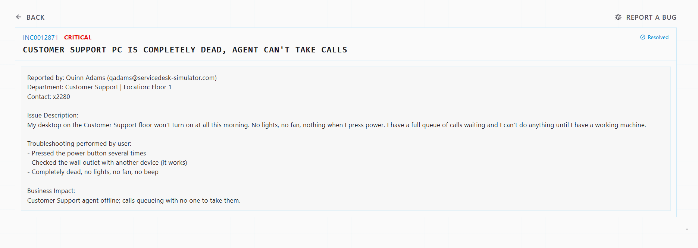
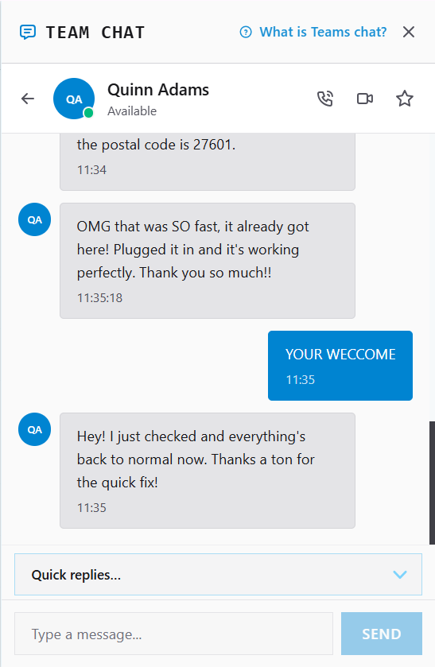

# Ticket INC0012871: Dead Customer Support Workstation

**Priority:** Critical
**Status:** Resolved
**Reported by:** Quinn Adams (qadams@servicedesk-simulator.com)
**Department:** Customer Support | Floor 1 | Contact: x2280

## Issue Description
User's desktop would not power on at all. No lights, no fan, no beep when pressing
the power button. User had a full queue of customer calls waiting, so the agent was
completely offline with no way to take calls.

## Business Impact
Customer Support agent offline; calls queueing with no one to take them. Direct
revenue/service impact given the Critical priority.

## Troubleshooting Steps

**Confirmed by user before escalation:**
- Pressed the power button several times -> no response
- Tested the wall outlet with a different device -> outlet confirmed working
- Result: completely dead, no lights, no fan, no beep

**My diagnosis:**
Since the outlet was confirmed good and the machine still showed zero signs of power
(no lights, no fan, no beep), this ruled out a simple power-source issue and pointed
to a hardware failure inside the unit itself (PSU or motherboard-level fault) rather
than a boot/POST problem.POST issues typically still show fan spin and lights, just
fail to display or beep-code correctly.

## Decision: Escalate for Replacement
Given the Critical priority and live business impact, I chose not to spend further
time diagnosing the exact internal hardware fault (outside Tier 1 scope without
physical access) and instead escalated for a full unit replacement to get the agent
back online as quickly as possible.

## Resolution Steps
1. Confirmed with the user that the machine type was a desktop, to make
   sure the replacement matched.
2. Built a replacement PC via **Server Imaging** (not Cloud Provisioning, Customer
   Support agents require the imaged build per internal documentation).
3. Followed SOP-OSD-014 (Endpoint Engineering) for the imaging process:
   - Caught the firmware boot menu (F12) and selected **PXE Network Boot IPv4**
     (IPv6 is not served on this network and will time out).
   - Authenticated to the deployment share using the deployment service account
     password (no username required).
   - Set `OSDComputerName` to the next asset tag, **SD2022**, via the Task Sequence
     Wizard.
   - Let the task sequence run fully (disk partition, image apply, app install,
     automatic domain join) without interrupting power.
   - Verified the build by signing in with domain credentials at the logon screen.
4. Registered the new asset (SD2022) in the asset register, assigned to Quinn Adams.
5. Opened Ship Manager, collected the user's shipping address, selected the matching
   desktop unit, enabled **Include return label**, set **Rush Priority (Instant)**,
   and shipped.
6. User received the replacement, plugged it in, and confirmed it was working.
   Dead unit returned using the prepaid label.

## Skills Demonstrated
- Hardware troubleshooting logic (isolating power-source vs. internal hardware fault)
- Priority-based escalation judgment (Critical impact → replace, don't over-diagnose)
- OSD/imaging workflow: PXE network boot, deployment credentials, task sequence,
  computer naming convention, domain sign-in verification
- Following a documented SOP precisely (SOP-OSD-014)
- Asset registration and lifecycle tracking
- Logistics coordination (shipping, rush priority, return process)

## What I'd Do Differently
Before assigning the asset tag SD2022, I should have checked the asset register
first to confirm it was actually the next free number rather than assuming it —
the SOP is explicit that names should never be reused or assigned without checking.
Going forward, I'll check the register before naming any new asset.
